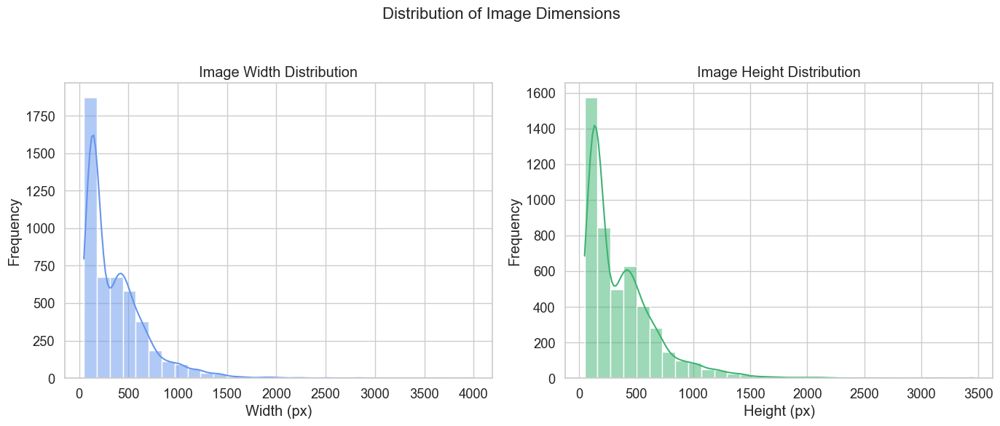

## Upload the dataset for creation of CNN, and check charasteristics

---


```python
# to donwload the file you need to have you kaggle api token istalled the path should be ~/.kaggle/kaggle.json
# The kaggle.json file should look like this:
# {
#   "username": "your_username",
#   "key": "your_key"
# }
from kaggle.api.kaggle_api_extended import KaggleApi
import os

# Initialize the Kaggle API
api = KaggleApi()
api.authenticate()

# Specify the competition name (plant-seedlings-classification)
competition_name = 'plant-seedlings-classification'

# Specify the download path
download_path = './plant_seedlings'

# Download the competition dataset
api.competition_download_files(competition_name, path=download_path)

print(f"Dataset downloaded to {download_path}")

```


    ---------------------------------------------------------------------------

    OSError                                   Traceback (most recent call last)

    Cell In[9], line 12
         10 # Initialize the Kaggle API
         11 api = KaggleApi()
    ---> 12 api.authenticate()
         14 # Specify the competition name (plant-seedlings-classification)
         15 competition_name = 'plant-seedlings-classification'


    File ~/Documents/APROF/CNN/venv/lib/python3.8/site-packages/kaggle/api/kaggle_api_extended.py:434, in KaggleApi.authenticate(self)
        432     return
        433   else:
    --> 434     raise IOError('Could not find {}. Make sure it\'s located in'
        435                   ' {}. Or use the environment method. See setup'
        436                   ' instructions at'
        437                   ' https://github.com/Kaggle/kaggle-api/'.format(
        438                       self.config_file, self.config_dir))
        440 # Step 3: load into configuration!
        441 self._load_config(config_data)


    OSError: Could not find kaggle.json. Make sure it's located in /Users/filiporlikowski/kaggle_api. Or use the environment method. See setup instructions at https://github.com/Kaggle/kaggle-api/


```python
import zipfile

# Unzip the dataset
with zipfile.ZipFile(f'{download_path}/{competition_name}.zip', 'r') as zip_ref:
    zip_ref.extractall(download_path)

print("Dataset extracted.")
```


    ---------------------------------------------------------------------------

    NameError                                 Traceback (most recent call last)

    Cell In[8], line 4
          1 import zipfile
          3 # Unzip the dataset
    ----> 4 with zipfile.ZipFile(f'{download_path}/{competition_name}.zip', 'r') as zip_ref:
          5     zip_ref.extractall(download_path)
          7 print("Dataset extracted.")


    NameError: name 'download_path' is not defined


```python
import numpy as np
import pandas as pd
import matplotlib.pyplot as plt
import matplotlib.image as mpimg
import os
import random
from PIL import Image


```


```python
train_dir = "./plant_seedlings/train"
test_dir = "./plant_seedlings/test"

# Get list of subdirectories (classes) and count images
class_counts = {}
for cls_name in os.listdir(train_dir):
    cls_path = os.path.join(train_dir, cls_name)
    if os.path.isdir(cls_path):
        image_files = [f for f in os.listdir(cls_path) if os.path.isfile(os.path.join(cls_path, f))]
        class_counts[cls_name] = len(image_files)

# Create DataFrame and sort by count
df_counts = pd.DataFrame(list(class_counts.items()), columns=['Class', 'Image Count'])
df_counts.sort_values(by='Image Count', ascending=False, inplace=True)

# Plotting
fig, ax = plt.subplots(figsize=(10, 6))
ax.bar(df_counts['Class'], df_counts['Image Count'])
ax.set_title("Number of Images per Class")
ax.set_xlabel("Class")
ax.set_ylabel("Image Count")
plt.xticks(rotation=45, ha='right', fontsize=10)
ax.grid(axis='y', linestyle='--', alpha=0.7)
plt.tight_layout()
plt.show()
```


    

    


```python
import os
import random
from PIL import Image
import pandas as pd
import plotly.subplots as sp
import plotly.graph_objects as go
import nbformat as nb
import IPython

# Create DataFrame of image counts per class
df_counts = pd.DataFrame(list(class_counts.items()), columns=['Class', 'Image Count'])
df_counts.sort_values(by='Image Count', ascending=False, inplace=True)

# Get class names
class_names = df_counts['Class'].tolist()

# Grid size (customize as needed)
n_rows, n_cols = 3, 4
max_images = n_rows * n_cols

# Initialize Plotly subplot figure
fig = sp.make_subplots(rows=n_rows, cols=n_cols,
                       subplot_titles=class_names[:max_images],
                       vertical_spacing=0.05, horizontal_spacing=0.03)

# Load and add images
img_idx = 0
for row in range(1, n_rows + 1):
    for col in range(1, n_cols + 1):
        if img_idx >= len(class_names):
            break
        cls = class_names[img_idx]
        cls_path = os.path.join(train_dir, cls)
        image_files = [f for f in os.listdir(cls_path) if os.path.isfile(os.path.join(cls_path, f))]
        if image_files:
            img_file = random.choice(image_files)
            img_path = os.path.join(cls_path, img_file)
            try:
                with Image.open(img_path) as img:
                    fig.add_trace(
                        go.Image(z=img),
                        row=row, col=col
                    )
            except Exception as e:
                print(f"Error loading image: {img_path} ({e})")
        img_idx += 1

# Update layout for cleaner visuals
fig.update_layout(
    height=800, width=1200,
    title_text="Example Images from Each Class (Interactive)",
    showlegend=False,
    title_x=0.5,
    margin=dict(l=10, r=10, t=60, b=10)
)

# Remove axes for all subplots
for i in range(1, n_rows * n_cols + 1):
    fig['layout'][f'xaxis{i}']['visible'] = False
    fig['layout'][f'yaxis{i}']['visible'] = False

fig.show()

```


We will also check balance of rgb colors, by plotting: RGB Channel Mean Distribution


```python
import numpy as np
import os
from PIL import Image
import pandas as pd
import matplotlib.pyplot as plt

# Function to compute RGB means
def compute_rgb_means(image_path):
    try:
        img = Image.open(image_path).convert('RGB')
        img_np = np.array(img) / 255.0  # Normalize pixel values to [0, 1]
        r_mean = np.mean(img_np[:, :, 0])
        g_mean = np.mean(img_np[:, :, 1])
        b_mean = np.mean(img_np[:, :, 2])
        return r_mean, g_mean, b_mean
    except:
        return None

# Collect the RGB means for all images
rgb_means = []

for cls in os.listdir(train_dir):
    cls_dir = os.path.join(train_dir, cls)
    for img_name in os.listdir(cls_dir):
        img_path = os.path.join(cls_dir, img_name)
        means = compute_rgb_means(img_path)
        if means:
            rgb_means.append(means)

# Convert to DataFrame
df_rgb = pd.DataFrame(rgb_means, columns=['R', 'G', 'B'])

# Check the mean and std dev of each color channel
mean_rgb = df_rgb.mean()
std_rgb = df_rgb.std()

print(f"Mean values per channel:\n{mean_rgb}")
print(f"Standard deviation per channel:\n{std_rgb}")

# Check correlations between channels (to see if any channel is too similar or too different)
correlation_matrix = df_rgb.corr()
print(f"Correlation between RGB channels:\n{correlation_matrix}")

# Plot histograms of R, G, B with matching colors
plt.figure(figsize=(10, 6))
df_rgb.plot(kind='hist', bins=30, alpha=0.6, color=['red', 'green', 'blue'])
plt.title('RGB Channel Mean Distribution')
plt.xlabel("Mean Value (0-1)")
plt.grid(alpha=0.3)
plt.tight_layout()
plt.show()

```

    Mean values per channel:
    R    0.328815
    G    0.289346
    B    0.207304
    dtype: float64
    Standard deviation per channel:
    R    0.034725
    G    0.037108
    B    0.050703
    dtype: float64
    Correlation between RGB channels:
              R         G         B
    R  1.000000  0.882091  0.764380
    G  0.882091  1.000000  0.858662
    B  0.764380  0.858662  1.000000


    <Figure size 1000x600 with 0 Axes>


    

    


From the graph we see that we should not encounter grayscale pictures, rgb colors are distinclty distributed with red channel resulting in a mean value of 0.32 we can definately call it a dominating color, then we have green 0.29, pictures presumably present plants, and blue 0.21 which is a minority among the rgb set of colors. But to be shure we will check for greenscale pictures, they should have similar values of rgb colors in them. We will also identify grayscale images in 'L' mode. But mostly we will focus on checking which images can not be opened as RGB and then converted to RGB.


```python
import os
from PIL import Image

corrupted_images = []

for cls in os.listdir(train_dir):
    cls_dir = os.path.join(train_dir, cls)
    for img_name in os.listdir(cls_dir):
        img_path = os.path.join(cls_dir, img_name)
        try:
            img = Image.open(img_path).convert('RGB')  # Try to open and convert to RGB
        except Exception as e:
            # If there's an error opening the image, add it to the corrupted list
            corrupted_images.append(img_path)
            print(f"Error opening {img_path}: {e}")

# Output the list of corrupted images
print(f"\nFound {len(corrupted_images)} corrupted or unreadable images.")
for img in corrupted_images:
    print(img)


```

    
    Found 0 corrupted or unreadable images.


We will also check the sizes of the images


```python
import os
from PIL import Image
import pandas as pd
import seaborn as sns
import matplotlib.pyplot as plt

# Set Seaborn theme for cleaner aesthetics
sns.set(style="whitegrid", palette="pastel", font_scale=1.2)

def collect_image_shapes(directory):
    shapes = []
    for class_name in os.listdir(directory):
        class_path = os.path.join(directory, class_name)
        if not os.path.isdir(class_path):
            continue
        for image_file in os.listdir(class_path):
            image_path = os.path.join(class_path, image_file)
            try:
                with Image.open(image_path) as img:
                    shapes.append(img.size)  # (width, height)
            except Exception as e:
                print(f"Could not open image: {image_path} ({e})")
    return shapes

# Collect image dimensions and create DataFrame
image_shapes = collect_image_shapes(train_dir)
df_shapes = pd.DataFrame(image_shapes, columns=['width', 'height'])

# Create figure with Seaborn plots
fig, axs = plt.subplots(1, 2, figsize=(14, 6))

sns.histplot(data=df_shapes, x='width', bins=30, ax=axs[0], kde=True, color='cornflowerblue')
axs[0].set_title('Image Width Distribution')
axs[0].set_xlabel('Width (px)')
axs[0].set_ylabel('Frequency')

sns.histplot(data=df_shapes, x='height', bins=30, ax=axs[1], kde=True, color='mediumseagreen')
axs[1].set_title('Image Height Distribution')
axs[1].set_xlabel('Height (px)')
axs[1].set_ylabel('Frequency')

plt.suptitle('Distribution of Image Dimensions', fontsize=16)
plt.tight_layout(rect=[0, 0, 1, 0.95])
plt.show()

```


    

    


Histograms show that most images range from 100 to 600 pixels in width and height, with a few large outliers exceeding 3000 pixels. This size variability suggests that resizing or normalization is needed before using the data in a CNN. We will also try to visualize the aspect ratio of images so that we know their shape.


```python
import seaborn as sns
import matplotlib.pyplot as plt

# Calculate Aspect Ratio
df_shapes['aspect_ratio'] = df_shapes['width'] / df_shapes['height']

# Set Seaborn style for improved visuals
sns.set(style="whitegrid", palette="muted", font_scale=1.2)

# Create a figure with custom size
plt.figure(figsize=(10, 6))

# Plot histogram of aspect ratios using Seaborn's histplot
sns.histplot(df_shapes['aspect_ratio'], bins=30, color='orchid', kde=True, edgecolor='black')

# Customize plot with titles and labels
plt.title("Aspect Ratio Distribution (Width / Height)", fontsize=16)
plt.xlabel("Aspect Ratio", fontsize=14)
plt.ylabel("Image Count", fontsize=14)

# Show grid with a soft transparency
plt.grid(alpha=0.3)

# Tight layout for better spacing
plt.tight_layout()

# Show the plot
plt.show()

```


    

    


A significant majority of the images have an aspect ratio close to 1, meaning that most of the images are square or nearly square. So knowing that the dataset primarily consists of square images, it is okay to standardize all images to a square resolution when preprocessing. Mostly because there are slim chances of changing the content of the picture.


## Preprocessing of the images


We will convert all images to RGB and resize them


```python
from tensorflow.keras.preprocessing.image import img_to_array
import os

# Parameters
IMG_SIZE = 96
DATASET_DIR = "./plant_seedlings/train"

# Containers
images = []
labels = []
class_names = sorted([d for d in os.listdir(DATASET_DIR) if os.path.isdir(os.path.join(DATASET_DIR, d))])

# Iterate through class folders and load images
for class_name in class_names:
    class_dir = os.path.join(DATASET_DIR, class_name)
    for filename in os.listdir(class_dir):
        img_path = os.path.join(class_dir, filename)
        try:
            # Open image, convert to RGB and resize
            img = Image.open(img_path).convert("RGB")
            img = img.resize((IMG_SIZE, IMG_SIZE))
            img_array = img_to_array(img) / 255.0  # Normalize to 0–1
            images.append(img_array)
            labels.append(class_name)
        except Exception as e:
            print(f"Skipping file {img_path}: {e}")

# Convert to numpy arrays
X = np.array(images)
y = np.array(labels)

print("Images loaded and resized")
print(f"Image shape: {X.shape}")
print(f"Unique classes: {len(np.unique(y))}")

```

    Images loaded and resized
    Image shape: (4750, 96, 96, 3)
    Unique classes: 12


We have also resized pictures to 224x224 becasue this is the samllest size and that most pictures have. We do it so that we have consistent input, and memory efficiency enhanced. Later we will convert string labels meaning classes of plants into integer indices for the CNN and then apply one-hot encoding to represent these labels as binary vectors. Then we will split the dataset into training, validation, and test sets using train_test_split, with stratified sampling to ensure class distribution is preserved in each split.


```python
from sklearn.model_selection import train_test_split
from tensorflow.keras.utils import to_categorical
import numpy as np

# Function to create label mappings and encode labels
def encode_labels(y):
    label_to_index = {label: idx for idx, label in enumerate(np.unique(y))}
    y_encoded = np.array([label_to_index[label] for label in y])
    return label_to_index, y_encoded

# One-hot encoding of labels
def one_hot_encode(y_encoded, num_classes):
    return to_categorical(y_encoded, num_classes=num_classes)

# Split the data into train, validation, and test sets
def split_data(X, y_categorical):
    X_train, X_test1, y_train, y_test1 = train_test_split(
        X, y_categorical, test_size=0.30, stratify=y_categorical, random_state=42
    )
    X_val, X_test, y_val, y_test = train_test_split(
        X_test1, y_test1, test_size=0.50, stratify=y_test1, random_state=42
    )
    return X_train, X_val, X_test, y_train, y_val, y_test

# Main execution
label_to_index, y_encoded = encode_labels(y)
y_categorical = one_hot_encode(y_encoded, num_classes=len(label_to_index))

X_train, X_val, X_test, y_train, y_val, y_test = split_data(X, y_categorical)

# Print shapes
print("Labels encoded and data split finished.")
print(f"X_train shape: {X_train.shape}")
print(f"y_train shape: {y_train.shape}")
print(f"X_val shape:   {X_val.shape}")
print(f"y_val shape:   {y_val.shape}")
print(f"X_test shape:  {X_test.shape}")
print(f"y_test shape:  {y_test.shape}")

```

    Labels encoded and data split finished.
    X_train shape: (3325, 96, 96, 3)
    y_train shape: (3325, 12)
    X_val shape:   (712, 96, 96, 3)
    y_val shape:   (712, 12)
    X_test shape:  (713, 96, 96, 3)
    y_test shape:  (713, 12)


Later we will processes images by applying green color segmentation, Gaussian blur, and normalization to isolate relevant green regions, making them suitable for CNN training. Since we want to clasify plants which are green. These steps will ensure that the images are cleaned, standardized, and that they focus on the desired features (green areas), which can enhance model performance for tasks like object recognition in plant-related datasets. What we want is sharp edges and close 0-1 color palette with distinction for green.


```python
import numpy as np
import cv2
import matplotlib.pyplot as plt
import seaborn as sns

# Set seaborn style for better aesthetics
sns.set(style="whitegrid")

# --- Settings for Green Segmentation ---
lower_green = (25, 40, 50)
upper_green = (75, 255, 255)
kernel = cv2.getStructuringElement(cv2.MORPH_ELLIPSE, (11, 11))

# --- Sharpening function using unsharp masking ---
def sharpen_image(img):
    # Apply a Gaussian blur to create a blurred version of the image
    blurred = cv2.GaussianBlur(img, (5, 5), 0)
    # Sharpening by subtracting the blurred image from the original
    sharpened = cv2.addWeighted(img, 1.5, blurred, -0.5, 0)
    return sharpened

# --- Preprocessing function ---
def preprocess_images(X):
    preprocessed = []
    for img in X:
        # 1. Convert to uint8 (0–255)
        img_uint8 = (img * 255).astype(np.uint8)

        # 2. Optional resize (images are 224x224 in this case)
        resize_img = img_uint8

        # 3. Apply Gaussian blur for smoothing
        Gblur_img = cv2.GaussianBlur(resize_img, (3, 3), 0)

        # 4. Convert to HSV for easier color segmentation
        hsv_img = cv2.cvtColor(Gblur_img, cv2.COLOR_RGB2HSV)  # RGB -> HSV

        # 5. Segment the green regions
        mask = cv2.inRange(hsv_img, lower_green, upper_green)

        # 6. Morphological cleaning (removing noise)
        mask = cv2.morphologyEx(mask, cv2.MORPH_CLOSE, kernel)

        # 7. Boolean mask to select green regions
        bMask = mask > 0

        # 8. Apply the mask to the image (keep only non-green parts)
        clearImg = np.zeros_like(resize_img, np.uint8)
        clearImg[bMask] = resize_img[bMask]

        # 9. Normalize the image (0–1)
        clearImg_float = clearImg.astype(np.float32) / 255.0

        # 10. Sharpen the edges of the image
        sharpened_img = sharpen_image(clearImg_float)

        preprocessed.append(sharpened_img)

    return np.asarray(preprocessed)

# --- Preprocessing the data (example for X_train) ---
X_train_cleaned = preprocess_images(X_train)
X_val_cleaned = preprocess_images(X_val)
X_test_cleaned = preprocess_images(X_test)

# --- Display a random example of original and processed image ---
def display_random_image(X_original, X_processed):
    # Random index for image selection
    idx = np.random.randint(0, len(X_original))

    # Fetch original and processed images
    original_img = X_original[idx]
    processed_img = X_processed[idx]

    # Create figure and axes
    fig, axes = plt.subplots(1, 2, figsize=(12, 6))

    # Display the original image
    axes[0].imshow(original_img)
    axes[0].set_title("Original Image", fontsize=14)
    axes[0].axis('off')  # Hide axes

    # Display the processed image
    axes[1].imshow(processed_img)
    axes[1].set_title("Segmented + Cleaned + Sharpened Image", fontsize=14)
    axes[1].axis('off')  # Hide axes

    # Adjust layout for better presentation
    plt.tight_layout()
    plt.show()

# Call the function to display a random image
display_random_image(X_train, X_train_cleaned)

```

    Clipping input data to the valid range for imshow with RGB data ([0..1] for floats or [0..255] for integers).


    

    


```python
print(f"Cleaned training shape: {X_train_cleaned.shape}")
print(f"Cleaned validation shape: {X_val_cleaned.shape}")
print(f"Cleaned test shape: {X_test_cleaned.shape}")

```

    Cleaned training shape: (3325, 96, 96, 3)
    Cleaned validation shape: (712, 96, 96, 3)
    Cleaned test shape: (713, 96, 96, 3)


# CNN model build


Looking for the right values of strides pools etc.


```python
from tensorflow.keras.models import Sequential
from tensorflow.keras.layers import Conv2D, MaxPooling2D, AveragePooling2D
from tensorflow.keras.layers import Flatten, Dense, Dropout, BatchNormalization, Input

def build_variant_model(
    input_shape,
    num_classes=12,
    filters=[32, 64, 128, 128],
    strides=2,
    padding='same',
    pool_type='max'  # or 'avg'
):
    model = Sequential()
    model.add(Input(shape=input_shape))

    for f in filters:
        model.add(Conv2D(f, (3, 3), activation='relu', padding=padding))
        model.add(BatchNormalization())
        if pool_type == 'max':
            model.add(MaxPooling2D(pool_size=(2, 2), strides=strides))
        else:
            model.add(AveragePooling2D(pool_size=(2, 2), strides=strides))

    model.add(Flatten())

    model.add(BatchNormalization())
    model.add(Dense(512, activation='relu'))
    model.add(Dropout(0.3))

    model.add(BatchNormalization())
    model.add(Dense(256, activation='relu'))
    model.add(Dropout(0.3))

    model.add(BatchNormalization())
    model.add(Dense(128, activation='relu'))
    model.add(Dropout(0.2))

    model.add(Dense(num_classes, activation='softmax'))

    return model

```

Training and comparing different variations


```python
import os
import time
from tensorflow.keras.optimizers import Adam
from tensorflow.keras.callbacks import EarlyStopping, ReduceLROnPlateau

early_stop = EarlyStopping(monitor='val_loss', patience=3, restore_best_weights=True, verbose=1)
reduce_lr = ReduceLROnPlateau(monitor='val_loss', factor=0.5, patience=2, min_lr=1e-6, verbose=1)

variants = {
    'Original': {},
    'More Filters': {'filters': [64, 128, 256, 256]},
    'Larger Stride': {'strides': 3},
    'Valid Padding': {'padding': 'valid'},
    'Average Pooling': {'pool_type': 'avg'},
}

results = {}
training_times = {}

# Make sure the base model directory exists
base_model_dir = 'models'
os.makedirs(base_model_dir, exist_ok=True)

for name, params in variants.items():
    print(f"\nTraining: {name}")
    model = build_variant_model(
        input_shape=X_train_cleaned.shape[1:],
        num_classes=y_train.shape[1],
        **params
    )

    model.compile(
        optimizer=Adam(learning_rate=0.001),
        loss='categorical_crossentropy',
        metrics=['accuracy']
    )

    start_time = time.time()

    history = model.fit(
        X_train_cleaned, y_train,
        validation_data=(X_val_cleaned, y_val),
        epochs=15,
        batch_size=8,
        callbacks=[early_stop, reduce_lr],
        verbose=1
    )

    end_time = time.time()
    elapsed_time = end_time - start_time

    results[name] = history.history
    training_times[name] = elapsed_time
    print(f"Training time for {name}: {elapsed_time:.2f} seconds")

    # Save the model
    safe_name = name.replace(" ", "_")  # e.g., "More Filters" -> "More_Filters"
    model_path = os.path.join(base_model_dir, safe_name)
    model.save(model_path)
    print(f"Model saved to {model_path}")

```

    WARNING:absl:At this time, the v2.11+ optimizer `tf.keras.optimizers.Adam` runs slowly on M1/M2 Macs, please use the legacy Keras optimizer instead, located at `tf.keras.optimizers.legacy.Adam`.
    WARNING:absl:There is a known slowdown when using v2.11+ Keras optimizers on M1/M2 Macs. Falling back to the legacy Keras optimizer, i.e., `tf.keras.optimizers.legacy.Adam`.


    
    Training: Original
    Epoch 1/15
    416/416 [==============================] - 18s 40ms/step - loss: 2.2870 - accuracy: 0.2436 - val_loss: 4.6432 - val_accuracy: 0.0604 - lr: 0.0010
    Epoch 2/15
    416/416 [==============================] - 15s 36ms/step - loss: 1.7598 - accuracy: 0.3889 - val_loss: 1.4391 - val_accuracy: 0.4972 - lr: 0.0010
    Epoch 3/15
    416/416 [==============================] - 17s 40ms/step - loss: 1.6283 - accuracy: 0.4430 - val_loss: 1.2581 - val_accuracy: 0.5983 - lr: 0.0010
    Epoch 4/15
    416/416 [==============================] - 15s 35ms/step - loss: 1.5415 - accuracy: 0.4704 - val_loss: 1.3538 - val_accuracy: 0.5758 - lr: 0.0010
    Epoch 5/15
    415/416 [============================>.] - ETA: 0s - loss: 1.4518 - accuracy: 0.4889
    Epoch 5: ReduceLROnPlateau reducing learning rate to 0.0005000000237487257.
    416/416 [==============================] - 15s 36ms/step - loss: 1.4506 - accuracy: 0.4893 - val_loss: 1.4146 - val_accuracy: 0.5000 - lr: 0.0010
    Epoch 6/15
    416/416 [==============================] - 16s 39ms/step - loss: 1.3121 - accuracy: 0.5465 - val_loss: 1.0874 - val_accuracy: 0.6320 - lr: 5.0000e-04
    Epoch 7/15
    416/416 [==============================] - 17s 40ms/step - loss: 1.2463 - accuracy: 0.5585 - val_loss: 0.9307 - val_accuracy: 0.6882 - lr: 5.0000e-04
    Epoch 8/15
    416/416 [==============================] - 16s 38ms/step - loss: 1.2137 - accuracy: 0.5841 - val_loss: 0.8621 - val_accuracy: 0.7093 - lr: 5.0000e-04
    Epoch 9/15
    416/416 [==============================] - 16s 38ms/step - loss: 1.1216 - accuracy: 0.6102 - val_loss: 1.2988 - val_accuracy: 0.5211 - lr: 5.0000e-04
    Epoch 10/15
    415/416 [============================>.] - ETA: 0s - loss: 1.0737 - accuracy: 0.6244
    Epoch 10: ReduceLROnPlateau reducing learning rate to 0.0002500000118743628.
    416/416 [==============================] - 15s 36ms/step - loss: 1.0740 - accuracy: 0.6241 - val_loss: 0.9919 - val_accuracy: 0.6601 - lr: 5.0000e-04
    Epoch 11/15
    416/416 [==============================] - 15s 36ms/step - loss: 0.9716 - accuracy: 0.6674 - val_loss: 0.7208 - val_accuracy: 0.7626 - lr: 2.5000e-04
    Epoch 12/15
    416/416 [==============================] - 15s 36ms/step - loss: 0.9485 - accuracy: 0.6761 - val_loss: 0.7782 - val_accuracy: 0.7458 - lr: 2.5000e-04
    Epoch 13/15
    416/416 [==============================] - 15s 35ms/step - loss: 0.8718 - accuracy: 0.6953 - val_loss: 0.7165 - val_accuracy: 0.7697 - lr: 2.5000e-04
    Epoch 14/15
    416/416 [==============================] - 58s 139ms/step - loss: 0.8570 - accuracy: 0.7062 - val_loss: 0.5974 - val_accuracy: 0.8062 - lr: 2.5000e-04
    Epoch 15/15
    416/416 [==============================] - 14s 33ms/step - loss: 0.7976 - accuracy: 0.7176 - val_loss: 0.6984 - val_accuracy: 0.7598 - lr: 2.5000e-04
    Training time for Original: 274.95 seconds
    INFO:tensorflow:Assets written to: models/Original/assets


    INFO:tensorflow:Assets written to: models/Original/assets
    WARNING:absl:At this time, the v2.11+ optimizer `tf.keras.optimizers.Adam` runs slowly on M1/M2 Macs, please use the legacy Keras optimizer instead, located at `tf.keras.optimizers.legacy.Adam`.
    WARNING:absl:There is a known slowdown when using v2.11+ Keras optimizers on M1/M2 Macs. Falling back to the legacy Keras optimizer, i.e., `tf.keras.optimizers.legacy.Adam`.


    Model saved to models/Original
    
    Training: More Filters
    Epoch 1/15
    416/416 [==============================] - 41s 99ms/step - loss: 2.2805 - accuracy: 0.2352 - val_loss: 5.5529 - val_accuracy: 0.0534 - lr: 0.0010
    Epoch 2/15
    416/416 [==============================] - 40s 97ms/step - loss: 1.8333 - accuracy: 0.3817 - val_loss: 1.6836 - val_accuracy: 0.4059 - lr: 0.0010
    Epoch 3/15
    416/416 [==============================] - 40s 96ms/step - loss: 1.6407 - accuracy: 0.4256 - val_loss: 1.4642 - val_accuracy: 0.5169 - lr: 0.0010
    Epoch 4/15
    416/416 [==============================] - 41s 98ms/step - loss: 1.5448 - accuracy: 0.4650 - val_loss: 1.1715 - val_accuracy: 0.6124 - lr: 0.0010
    Epoch 5/15
    416/416 [==============================] - 38s 92ms/step - loss: 1.4510 - accuracy: 0.4893 - val_loss: 1.2056 - val_accuracy: 0.5955 - lr: 0.0010
    Epoch 6/15
    416/416 [==============================] - ETA: 0s - loss: 1.3933 - accuracy: 0.5158
    Epoch 6: ReduceLROnPlateau reducing learning rate to 0.0005000000237487257.
    416/416 [==============================] - 41s 99ms/step - loss: 1.3933 - accuracy: 0.5158 - val_loss: 1.6236 - val_accuracy: 0.5562 - lr: 0.0010
    Epoch 7/15
    416/416 [==============================] - 40s 97ms/step - loss: 1.2508 - accuracy: 0.5585 - val_loss: 0.9273 - val_accuracy: 0.6952 - lr: 5.0000e-04
    Epoch 8/15
    416/416 [==============================] - 37s 88ms/step - loss: 1.2033 - accuracy: 0.5832 - val_loss: 1.2926 - val_accuracy: 0.5772 - lr: 5.0000e-04
    Epoch 9/15
    416/416 [==============================] - ETA: 0s - loss: 1.1366 - accuracy: 0.6018
    Epoch 9: ReduceLROnPlateau reducing learning rate to 0.0002500000118743628.
    416/416 [==============================] - 39s 93ms/step - loss: 1.1366 - accuracy: 0.6018 - val_loss: 1.0497 - val_accuracy: 0.6039 - lr: 5.0000e-04
    Epoch 10/15
    416/416 [==============================] - ETA: 0s - loss: 1.0004 - accuracy: 0.6487Restoring model weights from the end of the best epoch: 7.
    416/416 [==============================] - 40s 95ms/step - loss: 1.0004 - accuracy: 0.6487 - val_loss: 1.0253 - val_accuracy: 0.6475 - lr: 2.5000e-04
    Epoch 10: early stopping
    Training time for More Filters: 397.39 seconds
    INFO:tensorflow:Assets written to: models/More_Filters/assets


    INFO:tensorflow:Assets written to: models/More_Filters/assets
    WARNING:absl:At this time, the v2.11+ optimizer `tf.keras.optimizers.Adam` runs slowly on M1/M2 Macs, please use the legacy Keras optimizer instead, located at `tf.keras.optimizers.legacy.Adam`.
    WARNING:absl:There is a known slowdown when using v2.11+ Keras optimizers on M1/M2 Macs. Falling back to the legacy Keras optimizer, i.e., `tf.keras.optimizers.legacy.Adam`.


    Model saved to models/More_Filters
    
    Training: Larger Stride
    Epoch 1/15
    416/416 [==============================] - 7s 17ms/step - loss: 2.3252 - accuracy: 0.2430 - val_loss: 2.8950 - val_accuracy: 0.1910 - lr: 0.0010
    Epoch 2/15
    416/416 [==============================] - 7s 16ms/step - loss: 1.8600 - accuracy: 0.3540 - val_loss: 1.4567 - val_accuracy: 0.5183 - lr: 0.0010
    Epoch 3/15
    416/416 [==============================] - 7s 17ms/step - loss: 1.6407 - accuracy: 0.4337 - val_loss: 2.2898 - val_accuracy: 0.3652 - lr: 0.0010
    Epoch 4/15
    416/416 [==============================] - 7s 18ms/step - loss: 1.5140 - accuracy: 0.4731 - val_loss: 1.4329 - val_accuracy: 0.5253 - lr: 0.0010
    Epoch 5/15
    416/416 [==============================] - 8s 20ms/step - loss: 1.4156 - accuracy: 0.5047 - val_loss: 2.6528 - val_accuracy: 0.3567 - lr: 0.0010
    Epoch 6/15
    416/416 [==============================] - 7s 17ms/step - loss: 1.3375 - accuracy: 0.5420 - val_loss: 1.0725 - val_accuracy: 0.6334 - lr: 0.0010
    Epoch 7/15
    416/416 [==============================] - 7s 17ms/step - loss: 1.2460 - accuracy: 0.5747 - val_loss: 2.8541 - val_accuracy: 0.4284 - lr: 0.0010
    Epoch 8/15
    414/416 [============================>.] - ETA: 0s - loss: 1.1839 - accuracy: 0.5933
    Epoch 8: ReduceLROnPlateau reducing learning rate to 0.0005000000237487257.
    416/416 [==============================] - 8s 19ms/step - loss: 1.1839 - accuracy: 0.5937 - val_loss: 1.2038 - val_accuracy: 0.6166 - lr: 0.0010
    Epoch 9/15
    416/416 [==============================] - 7s 17ms/step - loss: 1.0280 - accuracy: 0.6460 - val_loss: 0.8916 - val_accuracy: 0.7149 - lr: 5.0000e-04
    Epoch 10/15
    416/416 [==============================] - 7s 16ms/step - loss: 0.9110 - accuracy: 0.6905 - val_loss: 0.8125 - val_accuracy: 0.7317 - lr: 5.0000e-04
    Epoch 11/15
    416/416 [==============================] - 7s 18ms/step - loss: 0.9090 - accuracy: 0.6905 - val_loss: 0.7897 - val_accuracy: 0.7289 - lr: 5.0000e-04
    Epoch 12/15
    416/416 [==============================] - 7s 16ms/step - loss: 0.8265 - accuracy: 0.7164 - val_loss: 0.8756 - val_accuracy: 0.7317 - lr: 5.0000e-04
    Epoch 13/15
    416/416 [==============================] - 6s 16ms/step - loss: 0.7820 - accuracy: 0.7356 - val_loss: 0.6462 - val_accuracy: 0.7921 - lr: 5.0000e-04
    Epoch 14/15
    416/416 [==============================] - 7s 17ms/step - loss: 0.6982 - accuracy: 0.7690 - val_loss: 0.6941 - val_accuracy: 0.7683 - lr: 5.0000e-04
    Epoch 15/15
    414/416 [============================>.] - ETA: 0s - loss: 0.6809 - accuracy: 0.7624
    Epoch 15: ReduceLROnPlateau reducing learning rate to 0.0002500000118743628.
    416/416 [==============================] - 7s 18ms/step - loss: 0.6805 - accuracy: 0.7624 - val_loss: 0.6849 - val_accuracy: 0.7809 - lr: 5.0000e-04
    Training time for Larger Stride: 106.77 seconds
    INFO:tensorflow:Assets written to: models/Larger_Stride/assets


    INFO:tensorflow:Assets written to: models/Larger_Stride/assets
    WARNING:absl:At this time, the v2.11+ optimizer `tf.keras.optimizers.Adam` runs slowly on M1/M2 Macs, please use the legacy Keras optimizer instead, located at `tf.keras.optimizers.legacy.Adam`.
    WARNING:absl:There is a known slowdown when using v2.11+ Keras optimizers on M1/M2 Macs. Falling back to the legacy Keras optimizer, i.e., `tf.keras.optimizers.legacy.Adam`.


    Model saved to models/Larger_Stride
    
    Training: Valid Padding
    Epoch 1/15
    416/416 [==============================] - 12s 27ms/step - loss: 2.2041 - accuracy: 0.2725 - val_loss: 4.3111 - val_accuracy: 0.1461 - lr: 0.0010
    Epoch 2/15
    416/416 [==============================] - 12s 28ms/step - loss: 1.7764 - accuracy: 0.3877 - val_loss: 1.3641 - val_accuracy: 0.5126 - lr: 0.0010
    Epoch 3/15
    416/416 [==============================] - 11s 27ms/step - loss: 1.6131 - accuracy: 0.4424 - val_loss: 2.3774 - val_accuracy: 0.3708 - lr: 0.0010
    Epoch 4/15
    416/416 [==============================] - 11s 25ms/step - loss: 1.5241 - accuracy: 0.4677 - val_loss: 1.2114 - val_accuracy: 0.5787 - lr: 0.0010
    Epoch 5/15
    416/416 [==============================] - 11s 26ms/step - loss: 1.3784 - accuracy: 0.5107 - val_loss: 1.2092 - val_accuracy: 0.5562 - lr: 0.0010
    Epoch 6/15
    416/416 [==============================] - 12s 28ms/step - loss: 1.3187 - accuracy: 0.5414 - val_loss: 1.0039 - val_accuracy: 0.6629 - lr: 0.0010
    Epoch 7/15
    416/416 [==============================] - 11s 26ms/step - loss: 1.2324 - accuracy: 0.5708 - val_loss: 1.6989 - val_accuracy: 0.5309 - lr: 0.0010
    Epoch 8/15
    415/416 [============================>.] - ETA: 0s - loss: 1.1568 - accuracy: 0.6105
    Epoch 8: ReduceLROnPlateau reducing learning rate to 0.0005000000237487257.
    416/416 [==============================] - 11s 26ms/step - loss: 1.1564 - accuracy: 0.6102 - val_loss: 1.6304 - val_accuracy: 0.5772 - lr: 0.0010
    Epoch 9/15
    416/416 [==============================] - 11s 26ms/step - loss: 1.0331 - accuracy: 0.6508 - val_loss: 0.7054 - val_accuracy: 0.7753 - lr: 5.0000e-04
    Epoch 10/15
    416/416 [==============================] - 11s 26ms/step - loss: 0.9406 - accuracy: 0.6731 - val_loss: 0.7392 - val_accuracy: 0.7472 - lr: 5.0000e-04
    Epoch 11/15
    414/416 [============================>.] - ETA: 0s - loss: 0.8857 - accuracy: 0.7011
    Epoch 11: ReduceLROnPlateau reducing learning rate to 0.0002500000118743628.
    416/416 [==============================] - 11s 26ms/step - loss: 0.8882 - accuracy: 0.7008 - val_loss: 0.7891 - val_accuracy: 0.7500 - lr: 5.0000e-04
    Epoch 12/15
    416/416 [==============================] - 11s 26ms/step - loss: 0.8144 - accuracy: 0.7200 - val_loss: 0.5688 - val_accuracy: 0.8160 - lr: 2.5000e-04
    Epoch 13/15
    416/416 [==============================] - 11s 26ms/step - loss: 0.7940 - accuracy: 0.7185 - val_loss: 0.5646 - val_accuracy: 0.8076 - lr: 2.5000e-04
    Epoch 14/15
    416/416 [==============================] - 11s 26ms/step - loss: 0.7358 - accuracy: 0.7411 - val_loss: 0.5600 - val_accuracy: 0.8118 - lr: 2.5000e-04
    Epoch 15/15
    416/416 [==============================] - 11s 26ms/step - loss: 0.6991 - accuracy: 0.7564 - val_loss: 1.0747 - val_accuracy: 0.6657 - lr: 2.5000e-04
    Training time for Valid Padding: 165.37 seconds
    INFO:tensorflow:Assets written to: models/Valid_Padding/assets


    INFO:tensorflow:Assets written to: models/Valid_Padding/assets
    WARNING:absl:At this time, the v2.11+ optimizer `tf.keras.optimizers.Adam` runs slowly on M1/M2 Macs, please use the legacy Keras optimizer instead, located at `tf.keras.optimizers.legacy.Adam`.
    WARNING:absl:There is a known slowdown when using v2.11+ Keras optimizers on M1/M2 Macs. Falling back to the legacy Keras optimizer, i.e., `tf.keras.optimizers.legacy.Adam`.


    Model saved to models/Valid_Padding
    
    Training: Average Pooling
    Epoch 1/15
    416/416 [==============================] - 14s 32ms/step - loss: 2.1749 - accuracy: 0.2782 - val_loss: 5.9018 - val_accuracy: 0.0604 - lr: 0.0010
    Epoch 2/15
    416/416 [==============================] - 13s 31ms/step - loss: 1.7590 - accuracy: 0.3994 - val_loss: 2.0076 - val_accuracy: 0.3315 - lr: 0.0010
    Epoch 3/15
    416/416 [==============================] - 13s 31ms/step - loss: 1.6124 - accuracy: 0.4409 - val_loss: 3.3295 - val_accuracy: 0.3160 - lr: 0.0010
    Epoch 4/15
    415/416 [============================>.] - ETA: 0s - loss: 1.5075 - accuracy: 0.4807
    Epoch 4: ReduceLROnPlateau reducing learning rate to 0.0005000000237487257.
    416/416 [==============================] - 13s 31ms/step - loss: 1.5091 - accuracy: 0.4803 - val_loss: 11.3132 - val_accuracy: 0.1868 - lr: 0.0010
    Epoch 5/15
    416/416 [==============================] - 13s 31ms/step - loss: 1.3745 - accuracy: 0.5278 - val_loss: 1.0409 - val_accuracy: 0.6292 - lr: 5.0000e-04
    Epoch 6/15
    416/416 [==============================] - 13s 31ms/step - loss: 1.3106 - accuracy: 0.5453 - val_loss: 1.0887 - val_accuracy: 0.6306 - lr: 5.0000e-04
    Epoch 7/15
    416/416 [==============================] - 13s 31ms/step - loss: 1.2349 - accuracy: 0.5744 - val_loss: 0.8834 - val_accuracy: 0.7065 - lr: 5.0000e-04
    Epoch 8/15
    416/416 [==============================] - 13s 31ms/step - loss: 1.1744 - accuracy: 0.5777 - val_loss: 0.9309 - val_accuracy: 0.7037 - lr: 5.0000e-04
    Epoch 9/15
    415/416 [============================>.] - ETA: 0s - loss: 1.1358 - accuracy: 0.6151
    Epoch 9: ReduceLROnPlateau reducing learning rate to 0.0002500000118743628.
    416/416 [==============================] - 13s 31ms/step - loss: 1.1359 - accuracy: 0.6150 - val_loss: 0.9169 - val_accuracy: 0.6938 - lr: 5.0000e-04
    Epoch 10/15
    416/416 [==============================] - 13s 30ms/step - loss: 1.0249 - accuracy: 0.6511 - val_loss: 0.6906 - val_accuracy: 0.7865 - lr: 2.5000e-04
    Epoch 11/15
    416/416 [==============================] - 13s 31ms/step - loss: 0.9913 - accuracy: 0.6577 - val_loss: 0.7968 - val_accuracy: 0.7388 - lr: 2.5000e-04
    Epoch 12/15
    415/416 [============================>.] - ETA: 0s - loss: 0.9584 - accuracy: 0.6798
    Epoch 12: ReduceLROnPlateau reducing learning rate to 0.0001250000059371814.
    416/416 [==============================] - 13s 31ms/step - loss: 0.9584 - accuracy: 0.6800 - val_loss: 0.7224 - val_accuracy: 0.7837 - lr: 2.5000e-04
    Epoch 13/15
    415/416 [============================>.] - ETA: 0s - loss: 0.8713 - accuracy: 0.7051Restoring model weights from the end of the best epoch: 10.
    416/416 [==============================] - 13s 31ms/step - loss: 0.8720 - accuracy: 0.7044 - val_loss: 0.8976 - val_accuracy: 0.6910 - lr: 1.2500e-04
    Epoch 13: early stopping
    Training time for Average Pooling: 167.33 seconds
    INFO:tensorflow:Assets written to: models/Average_Pooling/assets


    INFO:tensorflow:Assets written to: models/Average_Pooling/assets


    Model saved to models/Average_Pooling


Plotting and analysing


```python
import matplotlib.pyplot as plt

plt.figure(figsize=(10, 6))
for name, history in results.items():
    val_loss = history.get('val_loss')
    if val_loss:  # Make sure it exists
        plt.plot(val_loss, label=name)

plt.title('Validation Loss Across Model Variants')
plt.xlabel('Epoch')
plt.ylabel('Validation Loss')
plt.legend()
plt.grid(True)
plt.tight_layout()
plt.show()

```


    

    


Change	Possible Impact
More filters	May improve accuracy but increase computation.
Larger strides	Reduces spatial resolution faster — may lose detail.
Valid padding	Shrinks feature maps — can lose edge info.
Average pooling	May retain smoother features vs. max-pooling (sharper features).

## Build of probably good model


```python
import numpy as np
from tensorflow.keras.models import Sequential
from tensorflow.keras.layers import Conv2D, MaxPooling2D, Flatten, Dense, Dropout, BatchNormalization, Input

ins = X_train_cleaned.shape[1:]

# Modified Best Model (adjustments to prevent overfitting and increase depth)
def build_no_callbacks_model(input_shape=(ins[0], ins[1], ins[2]), num_classes=12):
    model = Sequential()

    # 1st Convolutional Block
    model.add(Input(shape=input_shape))
    model.add(Conv2D(32, (3, 3), activation='relu', padding='same'))
    model.add(BatchNormalization())
    model.add(MaxPooling2D(pool_size=(2, 2), strides=2))

    # 2nd Convolutional Block
    model.add(Conv2D(64, (3, 3), activation='relu', padding='same'))
    model.add(BatchNormalization())
    model.add(MaxPooling2D(pool_size=(2, 2), strides=2))

    # 3rd Convolutional Block
    model.add(Conv2D(128, (3, 3), activation='relu', padding='same'))
    model.add(BatchNormalization())
    model.add(MaxPooling2D(pool_size=(2, 2), strides=2))

    # 4th Convolutional Block (additional block to add more depth)
    model.add(Conv2D(128, (3, 3), activation='relu', padding='valid'))  # No padding
    model.add(BatchNormalization())
    model.add(MaxPooling2D(pool_size=(2, 2), strides=2))

    # Flatten before Dense layers
    model.add(Flatten())

    # Fully Connected Layers
    model.add(BatchNormalization())
    model.add(Dense(512, activation='relu'))
    model.add(Dropout(0.3))  # Increased dropout to 0.3 for more regularization

    model.add(BatchNormalization())
    model.add(Dense(256, activation='relu'))  # Increased units in dense layer
    model.add(Dropout(0.3))  # Dropout to avoid overfitting

    model.add(BatchNormalization())
    model.add(Dense(128, activation='relu'))
    model.add(Dropout(0.2))  # Dropout at the final dense layer

    # Output Layer
    model.add(Dense(num_classes, activation='softmax'))

    return model

```

## Running the probable model but without callbacks


```python
from tensorflow.keras.optimizers.legacy import Adam
from tensorflow.keras.callbacks import ReduceLROnPlateau, EarlyStopping

model = build_no_callbacks_model()

from tensorflow.keras.metrics import Precision, Recall

model.compile(
    optimizer=Adam(learning_rate=0.001, beta_1=0.9, beta_2=0.999, epsilon=1e-08),
    loss='categorical_crossentropy',
    metrics=['accuracy', Precision(), Recall()]
)

history1 = model.fit(
    X_train_cleaned, y_train,
    validation_data=(X_val_cleaned, y_val),
    epochs=30,
    batch_size=8
)

```

    Epoch 1/30
    416/416 [==============================] - 13s 31ms/step - loss: 2.1599 - accuracy: 0.2938 - precision_2: 0.4576 - recall_2: 0.1299 - val_loss: 7.0940 - val_accuracy: 0.0604 - val_precision_2: 0.0604 - val_recall_2: 0.0604
    Epoch 2/30
    416/416 [==============================] - 13s 30ms/step - loss: 1.7520 - accuracy: 0.3979 - precision_2: 0.5398 - recall_2: 0.2265 - val_loss: 1.4674 - val_accuracy: 0.4972 - val_precision_2: 0.6404 - val_recall_2: 0.2626
    Epoch 3/30
    416/416 [==============================] - 13s 30ms/step - loss: 1.6352 - accuracy: 0.4340 - precision_2: 0.6020 - recall_2: 0.2689 - val_loss: 1.4389 - val_accuracy: 0.5070 - val_precision_2: 0.6525 - val_recall_2: 0.4087
    Epoch 4/30
    416/416 [==============================] - 13s 30ms/step - loss: 1.5010 - accuracy: 0.4770 - precision_2: 0.6145 - recall_2: 0.2914 - val_loss: 1.1779 - val_accuracy: 0.5927 - val_precision_2: 0.7559 - val_recall_2: 0.4480
    Epoch 5/30
    416/416 [==============================] - 13s 30ms/step - loss: 1.3910 - accuracy: 0.5143 - precision_2: 0.6531 - recall_2: 0.3438 - val_loss: 1.8685 - val_accuracy: 0.4663 - val_precision_2: 0.5711 - val_recall_2: 0.3497
    Epoch 6/30
    416/416 [==============================] - 13s 30ms/step - loss: 1.3101 - accuracy: 0.5441 - precision_2: 0.6674 - recall_2: 0.3826 - val_loss: 1.2315 - val_accuracy: 0.5955 - val_precision_2: 0.7146 - val_recall_2: 0.4817
    Epoch 7/30
    416/416 [==============================] - 13s 30ms/step - loss: 1.2292 - accuracy: 0.5711 - precision_2: 0.6974 - recall_2: 0.4319 - val_loss: 1.0741 - val_accuracy: 0.6475 - val_precision_2: 0.7570 - val_recall_2: 0.5337
    Epoch 8/30
    416/416 [==============================] - 13s 31ms/step - loss: 1.2111 - accuracy: 0.5792 - precision_2: 0.6938 - recall_2: 0.4382 - val_loss: 0.9124 - val_accuracy: 0.6966 - val_precision_2: 0.8073 - val_recall_2: 0.5295
    Epoch 9/30
    416/416 [==============================] - 13s 31ms/step - loss: 1.1393 - accuracy: 0.6171 - precision_2: 0.7225 - recall_2: 0.4854 - val_loss: 0.9414 - val_accuracy: 0.7205 - val_precision_2: 0.8094 - val_recall_2: 0.6320
    Epoch 10/30
    416/416 [==============================] - 13s 31ms/step - loss: 1.0802 - accuracy: 0.6301 - precision_2: 0.7352 - recall_2: 0.5119 - val_loss: 0.7719 - val_accuracy: 0.7472 - val_precision_2: 0.8060 - val_recall_2: 0.6770
    Epoch 11/30
    416/416 [==============================] - 13s 31ms/step - loss: 1.0131 - accuracy: 0.6662 - precision_2: 0.7697 - recall_2: 0.5528 - val_loss: 1.3748 - val_accuracy: 0.5913 - val_precision_2: 0.6432 - val_recall_2: 0.5393
    Epoch 12/30
    416/416 [==============================] - 13s 30ms/step - loss: 1.0120 - accuracy: 0.6602 - precision_2: 0.7552 - recall_2: 0.5510 - val_loss: 1.2508 - val_accuracy: 0.6081 - val_precision_2: 0.6900 - val_recall_2: 0.5407
    Epoch 13/30
    416/416 [==============================] - 13s 30ms/step - loss: 0.9484 - accuracy: 0.6791 - precision_2: 0.7621 - recall_2: 0.5789 - val_loss: 1.0445 - val_accuracy: 0.6994 - val_precision_2: 0.7451 - val_recall_2: 0.6447
    Epoch 14/30
    416/416 [==============================] - 13s 31ms/step - loss: 0.9017 - accuracy: 0.6992 - precision_2: 0.7673 - recall_2: 0.6039 - val_loss: 0.8597 - val_accuracy: 0.7135 - val_precision_2: 0.7831 - val_recall_2: 0.6643
    Epoch 15/30
    416/416 [==============================] - 13s 31ms/step - loss: 0.8270 - accuracy: 0.7215 - precision_2: 0.7914 - recall_2: 0.6379 - val_loss: 1.2504 - val_accuracy: 0.6292 - val_precision_2: 0.6748 - val_recall_2: 0.5857
    Epoch 16/30
    416/416 [==============================] - 13s 31ms/step - loss: 0.8204 - accuracy: 0.7179 - precision_2: 0.7779 - recall_2: 0.6499 - val_loss: 1.0351 - val_accuracy: 0.7163 - val_precision_2: 0.7630 - val_recall_2: 0.6784
    Epoch 17/30
    416/416 [==============================] - 13s 30ms/step - loss: 0.8364 - accuracy: 0.7149 - precision_2: 0.7855 - recall_2: 0.6433 - val_loss: 0.9065 - val_accuracy: 0.7205 - val_precision_2: 0.7787 - val_recall_2: 0.6770
    Epoch 18/30
    416/416 [==============================] - 13s 30ms/step - loss: 0.8096 - accuracy: 0.7308 - precision_2: 0.7907 - recall_2: 0.6532 - val_loss: 0.6460 - val_accuracy: 0.7739 - val_precision_2: 0.8294 - val_recall_2: 0.7444
    Epoch 19/30
    416/416 [==============================] - 13s 30ms/step - loss: 0.7826 - accuracy: 0.7441 - precision_2: 0.8009 - recall_2: 0.6764 - val_loss: 1.4715 - val_accuracy: 0.6784 - val_precision_2: 0.7138 - val_recall_2: 0.6376
    Epoch 20/30
    416/416 [==============================] - 13s 30ms/step - loss: 0.7654 - accuracy: 0.7356 - precision_2: 0.7979 - recall_2: 0.6734 - val_loss: 0.6356 - val_accuracy: 0.7823 - val_precision_2: 0.8276 - val_recall_2: 0.7486
    Epoch 21/30
    416/416 [==============================] - 13s 30ms/step - loss: 0.6932 - accuracy: 0.7570 - precision_2: 0.8097 - recall_2: 0.6974 - val_loss: 0.7340 - val_accuracy: 0.7865 - val_precision_2: 0.8263 - val_recall_2: 0.7683
    Epoch 22/30
    416/416 [==============================] - 13s 30ms/step - loss: 0.7527 - accuracy: 0.7474 - precision_2: 0.8063 - recall_2: 0.6824 - val_loss: 0.6023 - val_accuracy: 0.8034 - val_precision_2: 0.8625 - val_recall_2: 0.7486
    Epoch 23/30
    416/416 [==============================] - 13s 30ms/step - loss: 0.7170 - accuracy: 0.7495 - precision_2: 0.8004 - recall_2: 0.6935 - val_loss: 0.5358 - val_accuracy: 0.8413 - val_precision_2: 0.8698 - val_recall_2: 0.8258
    Epoch 24/30
    416/416 [==============================] - 13s 30ms/step - loss: 0.6628 - accuracy: 0.7702 - precision_2: 0.8182 - recall_2: 0.7080 - val_loss: 6.6440 - val_accuracy: 0.3750 - val_precision_2: 0.3794 - val_recall_2: 0.3469
    Epoch 25/30
    416/416 [==============================] - 13s 30ms/step - loss: 0.6587 - accuracy: 0.7732 - precision_2: 0.8254 - recall_2: 0.7137 - val_loss: 0.6642 - val_accuracy: 0.7935 - val_precision_2: 0.8281 - val_recall_2: 0.7711
    Epoch 26/30
    416/416 [==============================] - 13s 30ms/step - loss: 0.6481 - accuracy: 0.7786 - precision_2: 0.8251 - recall_2: 0.7209 - val_loss: 0.6720 - val_accuracy: 0.8006 - val_precision_2: 0.8369 - val_recall_2: 0.7711
    Epoch 27/30
    416/416 [==============================] - 13s 30ms/step - loss: 0.5929 - accuracy: 0.7934 - precision_2: 0.8326 - recall_2: 0.7465 - val_loss: 0.5395 - val_accuracy: 0.8188 - val_precision_2: 0.8684 - val_recall_2: 0.7416
    Epoch 28/30
    416/416 [==============================] - 13s 30ms/step - loss: 0.6339 - accuracy: 0.7829 - precision_2: 0.8354 - recall_2: 0.7341 - val_loss: 0.5311 - val_accuracy: 0.8216 - val_precision_2: 0.8818 - val_recall_2: 0.7963
    Epoch 29/30
    416/416 [==============================] - 13s 30ms/step - loss: 0.5862 - accuracy: 0.7976 - precision_2: 0.8395 - recall_2: 0.7537 - val_loss: 1.0180 - val_accuracy: 0.6910 - val_precision_2: 0.7344 - val_recall_2: 0.6447
    Epoch 30/30
    416/416 [==============================] - 13s 30ms/step - loss: 0.6132 - accuracy: 0.7907 - precision_2: 0.8425 - recall_2: 0.7498 - val_loss: 0.8231 - val_accuracy: 0.7570 - val_precision_2: 0.8074 - val_recall_2: 0.7008


## Illustration of convolution results of a specific Layer[1,2,3]no 1 is specified now it the code, visualisation of feature maps


```python
for i, layer in enumerate(model.layers):
    print(i, layer.name, layer.output_shape)
```

    0 conv2d_36 (None, 96, 96, 32)
    1 batch_normalization_63 (None, 96, 96, 32)
    2 max_pooling2d_32 (None, 48, 48, 32)
    3 conv2d_37 (None, 48, 48, 64)
    4 batch_normalization_64 (None, 48, 48, 64)
    5 max_pooling2d_33 (None, 24, 24, 64)
    6 conv2d_38 (None, 24, 24, 128)
    7 batch_normalization_65 (None, 24, 24, 128)
    8 max_pooling2d_34 (None, 12, 12, 128)
    9 conv2d_39 (None, 10, 10, 128)
    10 batch_normalization_66 (None, 10, 10, 128)
    11 max_pooling2d_35 (None, 5, 5, 128)
    12 flatten_9 (None, 3200)
    13 batch_normalization_67 (None, 3200)
    14 dense_36 (None, 512)
    15 dropout_27 (None, 512)
    16 batch_normalization_68 (None, 512)
    17 dense_37 (None, 256)
    18 dropout_28 (None, 256)
    19 batch_normalization_69 (None, 256)
    20 dense_38 (None, 128)
    21 dropout_29 (None, 128)
    22 dense_39 (None, 12)


```python

import matplotlib.pyplot as plt
from tensorflow.keras.models import Model
import numpy as np


# Pick a sample image (reshape if needed)
sample_image = X_val_cleaned[0]  # shape: (H, W, C)
sample_image = np.expand_dims(sample_image, axis=0)  # add batch dimension

# Pick a layer to visualize (e.g., 'conv2d' or layer index)
layer_name = 'conv2d'  # or model.layers[1].name
intermediate_layer_model = Model(inputs=model.input,
                                 outputs=model.layers[1].output)

# Get feature maps
feature_maps = intermediate_layer_model.predict(sample_image)

# Plot the feature maps
num_filters = feature_maps.shape[-1]
size = feature_maps.shape[1]

plt.figure(figsize=(20, 8))
for i in range(min(num_filters, 16)):  # Show first 16 filters
    ax = plt.subplot(2, 8, i + 1)
    plt.imshow(feature_maps[0, :, :, i], cmap='viridis')
    plt.axis('off')
    plt.title(f'Filter {i}')
plt.suptitle(f"Feature maps from layer: {layer_name}", fontsize=16)
plt.show()

```

    1/1 [==============================] - 0s 63ms/step


    

    


Insights:

## Accuracy of the probable model without callbacks


```python
results = model.evaluate(X_test_cleaned, y_test)
```

    23/23 [==============================] - 1s 27ms/step - loss: 0.7355 - accuracy: 0.7966 - precision_1: 0.8349 - recall_1: 0.7588


```python
import numpy as np
import matplotlib.pyplot as plt
from sklearn.metrics import confusion_matrix, classification_report
import itertools

# --- Funkcja rysująca confusion matrix ---
def plot_confusion_matrix(cm, classes,
                          normalize=False,
                          title='Confusion Matrix',
                          cmap=plt.cm.Blues):  # Change the colormap here
    plt.figure(figsize=(10, 10))
    plt.imshow(cm, interpolation='nearest', cmap=cmap)
    plt.title(title)
    plt.colorbar()

    tick_marks = np.arange(len(classes))
    plt.xticks(tick_marks, classes, rotation=90)
    plt.yticks(tick_marks, classes)

    if normalize:
        cm = cm.astype('float') / cm.sum(axis=1)[:, np.newaxis]

    thresh = cm.max() / 2.
    for i, j in itertools.product(range(cm.shape[0]), range(cm.shape[1])):
        plt.text(j, i, f'{cm[i, j]:.2f}' if normalize else f'{cm[i, j]}',
                 horizontalalignment="center",
                 color="white" if cm[i, j] > thresh else "black")

    plt.ylabel('True label')
    plt.xlabel('Predicted label')
    plt.tight_layout()

# --- Predykcje modelu na testowym zbiorze ---
predY = model.predict(X_test_cleaned)
predYClasses = np.argmax(predY, axis=1)  # Predicted classes (0-based index)
trueY = np.argmax(y_test, axis=1)        # True labels (0-based index)

# --- Macierz pomyłek (Confusion Matrix) ---
confusionMTX = confusion_matrix(trueY, predYClasses)

# --- Reverse the label-to-index mapping ---
# If label_to_index maps {class_name: index}, reverse it to {index: class_name}
index_to_label = {v: k for k, v in label_to_index.items()}

# --- Get class names for plotting ---
categ = [index_to_label[i] for i in range(len(index_to_label))]

# --- Rysowanie confusion matrix ---
plot_confusion_matrix(confusionMTX, classes=categ, normalize=False, cmap=plt.cm.Oranges)

# --- Classification report ---
print("\n--- Classification Report ---")
print(classification_report(trueY, predYClasses, target_names=categ))

```

    23/23 [==============================] - 1s 29ms/step
    
    --- Classification Report ---
                               precision    recall  f1-score   support
    
                  Black-grass       0.52      0.28      0.37        39
                     Charlock       0.94      0.57      0.71        58
                     Cleavers       0.93      0.65      0.77        43
             Common Chickweed       0.81      0.82      0.81        92
                 Common wheat       0.63      0.82      0.71        33
                      Fat Hen       0.70      0.97      0.81        72
             Loose Silky-bent       0.74      0.91      0.82        98
                        Maize       0.88      0.70      0.78        33
            Scentless Mayweed       0.75      0.59      0.66        78
              Shepherds Purse       0.43      0.62      0.51        34
    Small-flowered Cranesbill       0.80      0.96      0.87        75
                   Sugar beet       0.93      0.72      0.82        58
    
                     accuracy                           0.75       713
                    macro avg       0.76      0.72      0.72       713
                 weighted avg       0.77      0.75      0.75       713
    


    

    


```python
import matplotlib.pyplot as plt

def plot_accuracy_and_loss(history):
    acc = history.history['accuracy']
    val_acc = history.history['val_accuracy']
    loss = history.history['loss']
    val_loss = history.history['val_loss']

    epochs = range(1, len(acc) + 1)

    plt.figure(figsize=(14, 5))

    # Accuracy Plot
    plt.subplot(1, 2, 1)
    plt.plot(epochs, acc, 'bo-', label='Training accuracy')
    plt.plot(epochs, val_acc, 'ro--', label='Validation accuracy')
    plt.title('Training and Validation Accuracy')
    plt.xlabel('Epoch')
    plt.ylabel('Accuracy')
    plt.legend()
    plt.grid(True)

    # Loss Plot
    plt.subplot(1, 2, 2)
    plt.plot(epochs, loss, 'bo-', label='Training loss')
    plt.plot(epochs, val_loss, 'ro--', label='Validation loss')
    plt.title('Training and Validation Loss')
    plt.xlabel('Epoch')
    plt.ylabel('Loss')
    plt.legend()
    plt.grid(True)

    plt.tight_layout()
    plt.show()

plot_accuracy_and_loss(history1)
```


    

    


There is definately some overfitting because:
We will now introduce such us Early Stopping and

## Running the model with callbacks


```python
from tensorflow.keras.optimizers import Adam
from tensorflow.keras.callbacks import ReduceLROnPlateau, EarlyStopping

# Define callbacks
early_stop = EarlyStopping(
    monitor='val_loss',
    patience=5,
    restore_best_weights=True,
    verbose=1
)

reduce_lr = ReduceLROnPlateau(
    monitor='val_loss',
    factor=0.5,
    patience=3,
    min_lr=1e-6,
    verbose=1
)

model = build_no_callbacks_model()

from tensorflow.keras.metrics import Precision, Recall

model.compile(
    optimizer=Adam(learning_rate=0.001, beta_1=0.9, beta_2=0.999, epsilon=1e-08),
    loss='categorical_crossentropy',
    metrics=['accuracy', Precision(), Recall()]
)

history2 = model.fit(
    X_train_cleaned, y_train,
    validation_data=(X_val_cleaned, y_val),
    epochs=50,
    batch_size=8,
    callbacks=[early_stop, reduce_lr]
)

```

    WARNING:absl:At this time, the v2.11+ optimizer `tf.keras.optimizers.Adam` runs slowly on M1/M2 Macs, please use the legacy Keras optimizer instead, located at `tf.keras.optimizers.legacy.Adam`.
    WARNING:absl:There is a known slowdown when using v2.11+ Keras optimizers on M1/M2 Macs. Falling back to the legacy Keras optimizer, i.e., `tf.keras.optimizers.legacy.Adam`.


    Epoch 1/50
    416/416 [==============================] - 14s 32ms/step - loss: 2.2947 - accuracy: 0.2439 - precision_3: 0.4017 - recall_3: 0.0842 - val_loss: 4.8314 - val_accuracy: 0.0829 - val_precision_3: 0.1028 - val_recall_3: 0.0829 - lr: 0.0010
    Epoch 2/50
    416/416 [==============================] - 14s 33ms/step - loss: 1.8646 - accuracy: 0.3492 - precision_3: 0.5248 - recall_3: 0.1717 - val_loss: 2.3300 - val_accuracy: 0.2416 - val_precision_3: 0.2952 - val_recall_3: 0.1559 - lr: 0.0010
    Epoch 3/50
    416/416 [==============================] - 13s 31ms/step - loss: 1.5928 - accuracy: 0.4535 - precision_3: 0.5964 - recall_3: 0.2698 - val_loss: 1.2176 - val_accuracy: 0.5899 - val_precision_3: 0.6989 - val_recall_3: 0.4466 - lr: 0.0010
    Epoch 4/50
    416/416 [==============================] - 14s 33ms/step - loss: 1.4824 - accuracy: 0.4854 - precision_3: 0.6153 - recall_3: 0.3002 - val_loss: 1.1927 - val_accuracy: 0.5885 - val_precision_3: 0.7383 - val_recall_3: 0.4199 - lr: 0.0010
    Epoch 5/50
    416/416 [==============================] - 13s 30ms/step - loss: 1.3559 - accuracy: 0.5149 - precision_3: 0.6486 - recall_3: 0.3558 - val_loss: 1.5491 - val_accuracy: 0.5604 - val_precision_3: 0.6243 - val_recall_3: 0.4972 - lr: 0.0010
    Epoch 6/50
    416/416 [==============================] - 12s 30ms/step - loss: 1.2818 - accuracy: 0.5528 - precision_3: 0.6720 - recall_3: 0.4054 - val_loss: 0.8871 - val_accuracy: 0.6924 - val_precision_3: 0.8198 - val_recall_3: 0.5815 - lr: 0.0010
    Epoch 7/50
    416/416 [==============================] - 13s 30ms/step - loss: 1.1972 - accuracy: 0.5889 - precision_3: 0.7076 - recall_3: 0.4490 - val_loss: 1.2585 - val_accuracy: 0.5632 - val_precision_3: 0.6632 - val_recall_3: 0.4508 - lr: 0.0010
    Epoch 8/50
    416/416 [==============================] - 12s 30ms/step - loss: 1.1382 - accuracy: 0.6087 - precision_3: 0.7174 - recall_3: 0.4818 - val_loss: 1.1298 - val_accuracy: 0.6699 - val_precision_3: 0.7415 - val_recall_3: 0.6124 - lr: 0.0010
    Epoch 9/50
    415/416 [============================>.] - ETA: 0s - loss: 1.0432 - accuracy: 0.6401 - precision_3: 0.7325 - recall_3: 0.5238
    Epoch 9: ReduceLROnPlateau reducing learning rate to 0.0005000000237487257.
    416/416 [==============================] - 13s 31ms/step - loss: 1.0434 - accuracy: 0.6400 - precision_3: 0.7321 - recall_3: 0.5236 - val_loss: 1.9476 - val_accuracy: 0.4789 - val_precision_3: 0.5237 - val_recall_3: 0.4508 - lr: 0.0010
    Epoch 10/50
    416/416 [==============================] - 13s 30ms/step - loss: 0.9391 - accuracy: 0.6725 - precision_3: 0.7590 - recall_3: 0.5777 - val_loss: 0.6523 - val_accuracy: 0.7823 - val_precision_3: 0.8391 - val_recall_3: 0.7472 - lr: 5.0000e-04
    Epoch 11/50
    416/416 [==============================] - 12s 30ms/step - loss: 0.8967 - accuracy: 0.7041 - precision_3: 0.7760 - recall_3: 0.6075 - val_loss: 0.7328 - val_accuracy: 0.7612 - val_precision_3: 0.8211 - val_recall_3: 0.7093 - lr: 5.0000e-04
    Epoch 12/50
    416/416 [==============================] - 13s 30ms/step - loss: 0.8329 - accuracy: 0.7125 - precision_3: 0.7854 - recall_3: 0.6295 - val_loss: 0.6920 - val_accuracy: 0.7851 - val_precision_3: 0.8351 - val_recall_3: 0.7612 - lr: 5.0000e-04
    Epoch 13/50
    416/416 [==============================] - 13s 32ms/step - loss: 0.8698 - accuracy: 0.7047 - precision_3: 0.7751 - recall_3: 0.6241 - val_loss: 0.6493 - val_accuracy: 0.8006 - val_precision_3: 0.8486 - val_recall_3: 0.7556 - lr: 5.0000e-04
    Epoch 14/50
    416/416 [==============================] - 13s 30ms/step - loss: 0.7696 - accuracy: 0.7314 - precision_3: 0.8039 - recall_3: 0.6559 - val_loss: 0.7029 - val_accuracy: 0.7626 - val_precision_3: 0.8156 - val_recall_3: 0.7205 - lr: 5.0000e-04
    Epoch 15/50
    416/416 [==============================] - 13s 30ms/step - loss: 0.7895 - accuracy: 0.7329 - precision_3: 0.7961 - recall_3: 0.6589 - val_loss: 0.6496 - val_accuracy: 0.7837 - val_precision_3: 0.8406 - val_recall_3: 0.7626 - lr: 5.0000e-04
    Epoch 16/50
    414/416 [============================>.] - ETA: 0s - loss: 0.7348 - accuracy: 0.7467 - precision_3: 0.8081 - recall_3: 0.6854
    Epoch 16: ReduceLROnPlateau reducing learning rate to 0.0002500000118743628.
    416/416 [==============================] - 12s 30ms/step - loss: 0.7359 - accuracy: 0.7468 - precision_3: 0.8079 - recall_3: 0.6854 - val_loss: 1.3252 - val_accuracy: 0.6152 - val_precision_3: 0.6536 - val_recall_3: 0.5857 - lr: 5.0000e-04
    Epoch 17/50
    416/416 [==============================] - 13s 30ms/step - loss: 0.6705 - accuracy: 0.7672 - precision_3: 0.8194 - recall_3: 0.7110 - val_loss: 1.0787 - val_accuracy: 0.6475 - val_precision_3: 0.7336 - val_recall_3: 0.6110 - lr: 2.5000e-04
    Epoch 18/50
    416/416 [==============================] - 13s 31ms/step - loss: 0.6396 - accuracy: 0.7795 - precision_3: 0.8388 - recall_3: 0.7248 - val_loss: 0.4682 - val_accuracy: 0.8539 - val_precision_3: 0.9003 - val_recall_3: 0.8118 - lr: 2.5000e-04
    Epoch 19/50
    416/416 [==============================] - 14s 34ms/step - loss: 0.6063 - accuracy: 0.7910 - precision_3: 0.8423 - recall_3: 0.7456 - val_loss: 0.4951 - val_accuracy: 0.8497 - val_precision_3: 0.8981 - val_recall_3: 0.8048 - lr: 2.5000e-04
    Epoch 20/50
    416/416 [==============================] - 14s 34ms/step - loss: 0.5827 - accuracy: 0.7952 - precision_3: 0.8431 - recall_3: 0.7516 - val_loss: 1.2073 - val_accuracy: 0.6643 - val_precision_3: 0.7013 - val_recall_3: 0.6166 - lr: 2.5000e-04
    Epoch 21/50
    414/416 [============================>.] - ETA: 0s - loss: 0.6132 - accuracy: 0.7865 - precision_3: 0.8421 - recall_3: 0.7388
    Epoch 21: ReduceLROnPlateau reducing learning rate to 0.0001250000059371814.
    416/416 [==============================] - 13s 32ms/step - loss: 0.6122 - accuracy: 0.7868 - precision_3: 0.8424 - recall_3: 0.7392 - val_loss: 0.5961 - val_accuracy: 0.8132 - val_precision_3: 0.8447 - val_recall_3: 0.7640 - lr: 2.5000e-04
    Epoch 22/50
    416/416 [==============================] - 13s 30ms/step - loss: 0.5510 - accuracy: 0.8156 - precision_3: 0.8605 - recall_3: 0.7699 - val_loss: 0.4788 - val_accuracy: 0.8441 - val_precision_3: 0.8831 - val_recall_3: 0.8272 - lr: 1.2500e-04
    Epoch 23/50
    416/416 [==============================] - 13s 30ms/step - loss: 0.5120 - accuracy: 0.8174 - precision_3: 0.8576 - recall_3: 0.7753 - val_loss: 0.4465 - val_accuracy: 0.8680 - val_precision_3: 0.9067 - val_recall_3: 0.8329 - lr: 1.2500e-04
    Epoch 24/50
    416/416 [==============================] - 12s 30ms/step - loss: 0.5197 - accuracy: 0.8144 - precision_3: 0.8623 - recall_3: 0.7798 - val_loss: 0.4517 - val_accuracy: 0.8581 - val_precision_3: 0.8831 - val_recall_3: 0.8272 - lr: 1.2500e-04
    Epoch 25/50
    416/416 [==============================] - 12s 30ms/step - loss: 0.4778 - accuracy: 0.8367 - precision_3: 0.8714 - recall_3: 0.7946 - val_loss: 0.4349 - val_accuracy: 0.8624 - val_precision_3: 0.8895 - val_recall_3: 0.8483 - lr: 1.2500e-04
    Epoch 26/50
    416/416 [==============================] - 13s 30ms/step - loss: 0.4880 - accuracy: 0.8250 - precision_3: 0.8608 - recall_3: 0.7889 - val_loss: 0.4564 - val_accuracy: 0.8680 - val_precision_3: 0.8859 - val_recall_3: 0.8399 - lr: 1.2500e-04
    Epoch 27/50
    416/416 [==============================] - 13s 30ms/step - loss: 0.4595 - accuracy: 0.8391 - precision_3: 0.8697 - recall_3: 0.7991 - val_loss: 0.4356 - val_accuracy: 0.8708 - val_precision_3: 0.9041 - val_recall_3: 0.8343 - lr: 1.2500e-04
    Epoch 28/50
    416/416 [==============================] - 13s 30ms/step - loss: 0.4375 - accuracy: 0.8409 - precision_3: 0.8720 - recall_3: 0.8195 - val_loss: 0.4210 - val_accuracy: 0.8624 - val_precision_3: 0.8810 - val_recall_3: 0.8525 - lr: 1.2500e-04
    Epoch 29/50
    416/416 [==============================] - 13s 30ms/step - loss: 0.4424 - accuracy: 0.8385 - precision_3: 0.8752 - recall_3: 0.8099 - val_loss: 0.4650 - val_accuracy: 0.8483 - val_precision_3: 0.8808 - val_recall_3: 0.8202 - lr: 1.2500e-04
    Epoch 30/50
    416/416 [==============================] - 13s 30ms/step - loss: 0.4429 - accuracy: 0.8523 - precision_3: 0.8818 - recall_3: 0.8192 - val_loss: 0.4336 - val_accuracy: 0.8722 - val_precision_3: 0.8908 - val_recall_3: 0.8596 - lr: 1.2500e-04
    Epoch 31/50
    416/416 [==============================] - 12s 30ms/step - loss: 0.4218 - accuracy: 0.8559 - precision_3: 0.8799 - recall_3: 0.8223 - val_loss: 0.4106 - val_accuracy: 0.8834 - val_precision_3: 0.9048 - val_recall_3: 0.8539 - lr: 1.2500e-04
    Epoch 32/50
    416/416 [==============================] - 12s 30ms/step - loss: 0.4478 - accuracy: 0.8412 - precision_3: 0.8757 - recall_3: 0.8114 - val_loss: 0.4171 - val_accuracy: 0.8764 - val_precision_3: 0.8946 - val_recall_3: 0.8581 - lr: 1.2500e-04
    Epoch 33/50
    416/416 [==============================] - 13s 30ms/step - loss: 0.4422 - accuracy: 0.8469 - precision_3: 0.8730 - recall_3: 0.8165 - val_loss: 0.4319 - val_accuracy: 0.8666 - val_precision_3: 0.8943 - val_recall_3: 0.8553 - lr: 1.2500e-04
    Epoch 34/50
    415/416 [============================>.] - ETA: 0s - loss: 0.4095 - accuracy: 0.8506 - precision_3: 0.8840 - recall_3: 0.8238
    Epoch 34: ReduceLROnPlateau reducing learning rate to 6.25000029685907e-05.
    416/416 [==============================] - 13s 30ms/step - loss: 0.4093 - accuracy: 0.8508 - precision_3: 0.8842 - recall_3: 0.8241 - val_loss: 0.5429 - val_accuracy: 0.8441 - val_precision_3: 0.8678 - val_recall_3: 0.8301 - lr: 1.2500e-04
    Epoch 35/50
    416/416 [==============================] - 13s 30ms/step - loss: 0.3823 - accuracy: 0.8565 - precision_3: 0.8827 - recall_3: 0.8286 - val_loss: 0.4066 - val_accuracy: 0.8736 - val_precision_3: 0.8913 - val_recall_3: 0.8638 - lr: 6.2500e-05
    Epoch 36/50
    416/416 [==============================] - 12s 30ms/step - loss: 0.3949 - accuracy: 0.8574 - precision_3: 0.8878 - recall_3: 0.8355 - val_loss: 0.3984 - val_accuracy: 0.8778 - val_precision_3: 0.8924 - val_recall_3: 0.8624 - lr: 6.2500e-05
    Epoch 37/50
    416/416 [==============================] - 12s 30ms/step - loss: 0.3885 - accuracy: 0.8583 - precision_3: 0.8865 - recall_3: 0.8382 - val_loss: 0.4255 - val_accuracy: 0.8680 - val_precision_3: 0.8920 - val_recall_3: 0.8581 - lr: 6.2500e-05
    Epoch 38/50
    416/416 [==============================] - 12s 30ms/step - loss: 0.3653 - accuracy: 0.8731 - precision_3: 0.8960 - recall_3: 0.8469 - val_loss: 0.4117 - val_accuracy: 0.8792 - val_precision_3: 0.8994 - val_recall_3: 0.8666 - lr: 6.2500e-05
    Epoch 39/50
    414/416 [============================>.] - ETA: 0s - loss: 0.3759 - accuracy: 0.8668 - precision_3: 0.8943 - recall_3: 0.8427
    Epoch 39: ReduceLROnPlateau reducing learning rate to 3.125000148429535e-05.
    416/416 [==============================] - 12s 30ms/step - loss: 0.3762 - accuracy: 0.8665 - precision_3: 0.8940 - recall_3: 0.8424 - val_loss: 0.4235 - val_accuracy: 0.8722 - val_precision_3: 0.8894 - val_recall_3: 0.8469 - lr: 6.2500e-05
    Epoch 40/50
    416/416 [==============================] - 12s 30ms/step - loss: 0.3646 - accuracy: 0.8695 - precision_3: 0.8927 - recall_3: 0.8454 - val_loss: 0.3998 - val_accuracy: 0.8750 - val_precision_3: 0.8934 - val_recall_3: 0.8596 - lr: 3.1250e-05
    Epoch 41/50
    414/416 [============================>.] - ETA: 0s - loss: 0.3532 - accuracy: 0.8723 - precision_3: 0.8979 - recall_3: 0.8493Restoring model weights from the end of the best epoch: 36.
    416/416 [==============================] - 13s 30ms/step - loss: 0.3535 - accuracy: 0.8719 - precision_3: 0.8973 - recall_3: 0.8490 - val_loss: 0.3988 - val_accuracy: 0.8750 - val_precision_3: 0.8965 - val_recall_3: 0.8638 - lr: 3.1250e-05
    Epoch 41: early stopping


 Interpretation:

✅ High precision and recall on validation data suggests the model is generalizing well and not overfitting.

✅ Validation accuracy > training accuracy can mean regularization (e.g., dropout, early stopping) helped prevent overfitting.

✅ Low validation loss confirms the model is confident and consistent in its predictions.

📉 Early Stopping
The message Restoring model weights from the end of the best epoch: 29 confirms that early stopping restored the best weights, avoiding any overfitting in the final epoch.
We then increased the number of Epochs to 50 so that we can better observe the Early Stopping callback behaviour. The program this time restorted weights at 35th epoch. While at the same time we increased patience the acuracy increased from 0.85-0.88

## Evaluation of accuracy


```python
import matplotlib.pyplot as plt

# Function to extract metrics for plotting
def extract_metrics(history):
    return (
        history.history['accuracy'],
        history.history['val_accuracy'],
        history.history['loss'],
        history.history['val_loss'],
    )

# Assuming these are available in your session already
histories = {
    #"Model 1": history1.history if 'history1' in globals() else None,
    "Model 2": history2.history if 'history2' in globals() else None
}

# Plotting
plt.figure(figsize=(16, 6))

# Plot accuracy
plt.subplot(1, 2, 1)
for name, h in histories.items():
    if h:  # Check if history is available
        plt.plot(h['accuracy'], label=f'{name} Train')
        plt.plot(h['val_accuracy'], linestyle='--', label=f'{name} Val')
plt.title('Model Accuracy')
plt.xlabel('Epoch')
plt.ylabel('Accuracy')
plt.legend()
plt.grid(True)

```


    

    


```python
results = model.evaluate(X_test_cleaned, y_test)
```

    23/23 [==============================] - 1s 26ms/step - loss: 0.3907 - accuracy: 0.8850 - precision_3: 0.8948 - recall_3: 0.8710


```python
import numpy as np
import matplotlib.pyplot as plt
from sklearn.metrics import confusion_matrix, classification_report
import itertools

# --- Funkcja rysująca confusion matrix ---
def plot_confusion_matrix(cm, classes,
                          normalize=False,
                          title='Confusion Matrix',
                          cmap=plt.cm.Blues):  # Change the colormap here
    plt.figure(figsize=(10, 10))
    plt.imshow(cm, interpolation='nearest', cmap=cmap)
    plt.title(title)
    plt.colorbar()

    tick_marks = np.arange(len(classes))
    plt.xticks(tick_marks, classes, rotation=90)
    plt.yticks(tick_marks, classes)

    if normalize:
        cm = cm.astype('float') / cm.sum(axis=1)[:, np.newaxis]

    thresh = cm.max() / 2.
    for i, j in itertools.product(range(cm.shape[0]), range(cm.shape[1])):
        plt.text(j, i, f'{cm[i, j]:.2f}' if normalize else f'{cm[i, j]}',
                 horizontalalignment="center",
                 color="white" if cm[i, j] > thresh else "black")

    plt.ylabel('True label')
    plt.xlabel('Predicted label')
    plt.tight_layout()

# --- Predykcje modelu na testowym zbiorze ---
predY = model.predict(X_test_cleaned)
predYClasses = np.argmax(predY, axis=1)  # Predicted classes (0-based index)
trueY = np.argmax(y_test, axis=1)        # True labels (0-based index)

# --- Macierz pomyłek (Confusion Matrix) ---
confusionMTX = confusion_matrix(trueY, predYClasses)

# --- Reverse the label-to-index mapping ---
# If label_to_index maps {class_name: index}, reverse it to {index: class_name}
index_to_label = {v: k for k, v in label_to_index.items()}

# --- Get class names for plotting ---
categ = [index_to_label[i] for i in range(len(index_to_label))]

# --- Rysowanie confusion matrix ---
plot_confusion_matrix(confusionMTX, classes=categ, normalize=False, cmap=plt.cm.Oranges)

# --- Classification report ---
print("\n--- Classification Report ---")
print(classification_report(trueY, predYClasses, target_names=categ))

```

    23/23 [==============================] - 1s 29ms/step
    
    --- Classification Report ---
                               precision    recall  f1-score   support
    
                  Black-grass       0.67      0.10      0.18        39
                     Charlock       0.98      0.93      0.96        58
                     Cleavers       0.93      0.95      0.94        43
             Common Chickweed       0.93      0.98      0.95        92
                 Common wheat       0.76      0.94      0.84        33
                      Fat Hen       0.97      0.96      0.97        72
             Loose Silky-bent       0.75      0.96      0.84        98
                        Maize       0.81      0.91      0.86        33
            Scentless Mayweed       0.91      0.90      0.90        78
              Shepherds Purse       0.77      0.71      0.74        34
    Small-flowered Cranesbill       0.99      0.96      0.97        75
                   Sugar beet       0.93      0.90      0.91        58
    
                     accuracy                           0.88       713
                    macro avg       0.87      0.85      0.84       713
                 weighted avg       0.88      0.88      0.87       713
    


    

    


```python
results = model.evaluate(X_test_cleaned, y_test)
```

    23/23 [==============================] - 1s 27ms/step - loss: 0.3907 - accuracy: 0.8850 - precision_3: 0.8948 - recall_3: 0.8710


## Adding data-augmentation and running models with it

here I will implement model with data augmentation


```python
from tensorflow.keras.optimizers import Adam
from tensorflow.keras.callbacks import ReduceLROnPlateau, EarlyStopping
from tensorflow.keras.preprocessing.image import ImageDataGenerator

# Define callbacks
early_stop = EarlyStopping(
    monitor='val_loss',
    patience=5,
    restore_best_weights=True,
    verbose=1
)

reduce_lr = ReduceLROnPlateau(
    monitor='val_loss',
    factor=0.5,
    patience=3,
    min_lr=1e-6,
    verbose=1
)

# Data Augmentation for training set only
datagen = ImageDataGenerator(
    rotation_range=15,
    width_shift_range=0.1,
    height_shift_range=0.1,
    zoom_range=0.1,
    horizontal_flip=True,
    fill_mode='nearest'
)

# Fit the generator to your data (optional, depending on data type)
datagen.fit(X_train_cleaned)

# Create the model
model = build_no_callbacks_model()

# Compile the model
model.compile(
    optimizer=Adam(learning_rate=0.001, beta_1=0.9, beta_2=0.999, epsilon=1e-08),
    loss='categorical_crossentropy',
    metrics = ['accuracy', Precision(), Recall()]
)

# Train the model using the augmented data
history = model.fit(
    datagen.flow(X_train_cleaned, y_train, batch_size=8),
    validation_data=(X_val_cleaned, y_val),
    epochs=50,
    callbacks=[early_stop, reduce_lr],
    steps_per_epoch=len(X_train_cleaned) // 8
)

```

    WARNING:absl:At this time, the v2.11+ optimizer `tf.keras.optimizers.Adam` runs slowly on M1/M2 Macs, please use the legacy Keras optimizer instead, located at `tf.keras.optimizers.legacy.Adam`.
    WARNING:absl:There is a known slowdown when using v2.11+ Keras optimizers on M1/M2 Macs. Falling back to the legacy Keras optimizer, i.e., `tf.keras.optimizers.legacy.Adam`.


    Epoch 1/50
    415/415 [==============================] - 14s 33ms/step - loss: 2.2816 - accuracy: 0.2418 - precision_1: 0.4114 - recall_1: 0.0889 - val_loss: 2.5630 - val_accuracy: 0.2093 - val_precision_1: 0.2000 - val_recall_1: 0.0843 - lr: 0.0010
    Epoch 2/50
    415/415 [==============================] - 13s 32ms/step - loss: 1.8676 - accuracy: 0.3729 - precision_1: 0.5009 - recall_1: 0.1682 - val_loss: 3.0607 - val_accuracy: 0.3315 - val_precision_1: 0.3814 - val_recall_1: 0.3118 - lr: 0.0010
    Epoch 3/50
    415/415 [==============================] - 13s 31ms/step - loss: 1.7039 - accuracy: 0.4121 - precision_1: 0.5609 - recall_1: 0.2195 - val_loss: 1.9721 - val_accuracy: 0.4565 - val_precision_1: 0.5347 - val_recall_1: 0.3792 - lr: 0.0010
    Epoch 4/50
    415/415 [==============================] - 13s 31ms/step - loss: 1.5729 - accuracy: 0.4549 - precision_1: 0.6176 - recall_1: 0.2581 - val_loss: 1.2445 - val_accuracy: 0.5857 - val_precision_1: 0.6736 - val_recall_1: 0.5014 - lr: 0.0010
    Epoch 5/50
    415/415 [==============================] - 13s 31ms/step - loss: 1.5107 - accuracy: 0.4781 - precision_1: 0.6349 - recall_1: 0.2831 - val_loss: 1.3131 - val_accuracy: 0.5449 - val_precision_1: 0.6280 - val_recall_1: 0.4480 - lr: 0.0010
    Epoch 6/50
    415/415 [==============================] - 13s 31ms/step - loss: 1.4567 - accuracy: 0.4971 - precision_1: 0.6355 - recall_1: 0.3075 - val_loss: 1.5677 - val_accuracy: 0.5000 - val_precision_1: 0.5854 - val_recall_1: 0.3947 - lr: 0.0010
    Epoch 7/50
    415/415 [==============================] - 13s 31ms/step - loss: 1.4008 - accuracy: 0.5107 - precision_1: 0.6465 - recall_1: 0.3325 - val_loss: 1.1748 - val_accuracy: 0.6152 - val_precision_1: 0.7041 - val_recall_1: 0.4846 - lr: 0.0010
    Epoch 8/50
    415/415 [==============================] - 13s 31ms/step - loss: 1.3866 - accuracy: 0.5240 - precision_1: 0.6567 - recall_1: 0.3184 - val_loss: 1.2085 - val_accuracy: 0.6138 - val_precision_1: 0.7160 - val_recall_1: 0.5028 - lr: 0.0010
    Epoch 9/50
    415/415 [==============================] - 13s 31ms/step - loss: 1.3659 - accuracy: 0.5297 - precision_1: 0.6576 - recall_1: 0.3440 - val_loss: 1.1047 - val_accuracy: 0.6404 - val_precision_1: 0.7690 - val_recall_1: 0.4396 - lr: 0.0010
    Epoch 10/50
    415/415 [==============================] - 13s 31ms/step - loss: 1.2920 - accuracy: 0.5574 - precision_1: 0.6911 - recall_1: 0.3892 - val_loss: 1.0527 - val_accuracy: 0.6376 - val_precision_1: 0.7505 - val_recall_1: 0.5449 - lr: 0.0010
    Epoch 11/50
    415/415 [==============================] - 13s 31ms/step - loss: 1.2724 - accuracy: 0.5668 - precision_1: 0.6875 - recall_1: 0.4073 - val_loss: 4.9838 - val_accuracy: 0.2626 - val_precision_1: 0.2958 - val_recall_1: 0.2402 - lr: 0.0010
    Epoch 12/50
    415/415 [==============================] - 13s 31ms/step - loss: 1.2632 - accuracy: 0.5674 - precision_1: 0.6916 - recall_1: 0.4130 - val_loss: 1.0918 - val_accuracy: 0.6770 - val_precision_1: 0.7262 - val_recall_1: 0.6222 - lr: 0.0010
    Epoch 13/50
    415/415 [==============================] - 13s 31ms/step - loss: 1.1448 - accuracy: 0.6114 - precision_1: 0.7058 - recall_1: 0.4715 - val_loss: 0.7493 - val_accuracy: 0.7374 - val_precision_1: 0.8046 - val_recall_1: 0.6882 - lr: 0.0010
    Epoch 14/50
    415/415 [==============================] - 13s 31ms/step - loss: 1.1174 - accuracy: 0.6232 - precision_1: 0.7323 - recall_1: 0.4980 - val_loss: 1.0463 - val_accuracy: 0.6699 - val_precision_1: 0.7449 - val_recall_1: 0.6110 - lr: 0.0010
    Epoch 15/50
    415/415 [==============================] - 13s 32ms/step - loss: 1.1269 - accuracy: 0.6198 - precision_1: 0.7308 - recall_1: 0.4959 - val_loss: 1.4965 - val_accuracy: 0.5913 - val_precision_1: 0.6361 - val_recall_1: 0.5351 - lr: 0.0010
    Epoch 16/50
    414/415 [============================>.] - ETA: 0s - loss: 1.0360 - accuracy: 0.6513 - precision_1: 0.7418 - recall_1: 0.5322
    Epoch 16: ReduceLROnPlateau reducing learning rate to 0.0005000000237487257.
    415/415 [==============================] - 13s 31ms/step - loss: 1.0354 - accuracy: 0.6518 - precision_1: 0.7421 - recall_1: 0.5327 - val_loss: 1.0958 - val_accuracy: 0.6952 - val_precision_1: 0.7387 - val_recall_1: 0.6433 - lr: 0.0010
    Epoch 17/50
    415/415 [==============================] - 13s 31ms/step - loss: 0.9386 - accuracy: 0.6828 - precision_1: 0.7632 - recall_1: 0.5822 - val_loss: 0.7106 - val_accuracy: 0.7458 - val_precision_1: 0.8152 - val_recall_1: 0.6938 - lr: 5.0000e-04
    Epoch 18/50
    415/415 [==============================] - 13s 31ms/step - loss: 0.9126 - accuracy: 0.6895 - precision_1: 0.7755 - recall_1: 0.6021 - val_loss: 0.4934 - val_accuracy: 0.8244 - val_precision_1: 0.8656 - val_recall_1: 0.7963 - lr: 5.0000e-04
    Epoch 19/50
    415/415 [==============================] - 13s 31ms/step - loss: 0.8903 - accuracy: 0.6982 - precision_1: 0.7773 - recall_1: 0.6177 - val_loss: 0.5644 - val_accuracy: 0.8104 - val_precision_1: 0.8552 - val_recall_1: 0.7795 - lr: 5.0000e-04
    Epoch 20/50
    415/415 [==============================] - 13s 31ms/step - loss: 0.8541 - accuracy: 0.7091 - precision_1: 0.7887 - recall_1: 0.6268 - val_loss: 0.8709 - val_accuracy: 0.6938 - val_precision_1: 0.8011 - val_recall_1: 0.6222 - lr: 5.0000e-04
    Epoch 21/50
    415/415 [==============================] - ETA: 0s - loss: 0.8238 - accuracy: 0.7166 - precision_1: 0.7898 - recall_1: 0.6367
    Epoch 21: ReduceLROnPlateau reducing learning rate to 0.0002500000118743628.
    415/415 [==============================] - 13s 32ms/step - loss: 0.8238 - accuracy: 0.7166 - precision_1: 0.7898 - recall_1: 0.6367 - val_loss: 0.5951 - val_accuracy: 0.8048 - val_precision_1: 0.8459 - val_recall_1: 0.7711 - lr: 5.0000e-04
    Epoch 22/50
    415/415 [==============================] - 14s 33ms/step - loss: 0.8095 - accuracy: 0.7320 - precision_1: 0.7971 - recall_1: 0.6539 - val_loss: 0.5043 - val_accuracy: 0.8315 - val_precision_1: 0.8664 - val_recall_1: 0.7921 - lr: 2.5000e-04
    Epoch 23/50
    414/415 [============================>.] - ETA: 0s - loss: 0.7918 - accuracy: 0.7347 - precision_1: 0.7997 - recall_1: 0.6636Restoring model weights from the end of the best epoch: 18.
    415/415 [==============================] - 13s 32ms/step - loss: 0.7917 - accuracy: 0.7350 - precision_1: 0.7999 - recall_1: 0.6642 - val_loss: 0.5005 - val_accuracy: 0.8343 - val_precision_1: 0.8756 - val_recall_1: 0.7809 - lr: 2.5000e-04
    Epoch 23: early stopping


```python
import numpy as np
import matplotlib.pyplot as plt
from sklearn.metrics import confusion_matrix, classification_report
import itertools

# --- Predict the classes on test set ---
y_pred_probs = model.predict(X_test_cleaned)
y_pred = np.argmax(y_pred_probs, axis=1)
y_true = np.argmax(y_test, axis=1)

# --- Create confusion matrix ---
conf_matrix = confusion_matrix(y_true, y_pred)

# --- Create label index mapping (reverse) ---
index_to_label = {v: k for k, v in label_to_index.items()}
class_names = [index_to_label[i] for i in range(len(index_to_label))]

# --- Plot confusion matrix ---
def plot_confusion_matrix(cm, classes,
                          normalize=False,
                          title='Confusion Matrix',
                          cmap=plt.cm.Blues):
    plt.figure(figsize=(10, 10))
    plt.imshow(cm, interpolation='nearest', cmap=cmap)
    plt.title(title, fontsize=16)
    plt.colorbar()

    tick_marks = np.arange(len(classes))
    plt.xticks(tick_marks, classes, rotation=90)
    plt.yticks(tick_marks, classes)

    if normalize:
        cm = cm.astype('float') / cm.sum(axis=1)[:, np.newaxis]
        print("Normalized confusion matrix")
    else:
        print("Confusion matrix, without normalization")

    thresh = cm.max() / 2.
    for i, j in itertools.product(range(cm.shape[0]), range(cm.shape[1])):
        value = f"{cm[i, j]:.2f}" if normalize else f"{cm[i, j]}"
        plt.text(j, i, value,
                 horizontalalignment="center",
                 color="white" if cm[i, j] > thresh else "black")

    plt.ylabel('True label', fontsize=12)
    plt.xlabel('Predicted label', fontsize=12)
    plt.tight_layout()
    plt.show()

# --- Show confusion matrix ---
plot_confusion_matrix(conf_matrix, classes=class_names, normalize=False, cmap=plt.cm.Oranges)

# --- Optional: Classification report ---
print("\nClassification Report:\n")
print(classification_report(y_true, y_pred, target_names=class_names))

```

    23/23 [==============================] - 1s 29ms/step
    Confusion matrix, without normalization


    

    


    
    Classification Report:
    
                               precision    recall  f1-score   support
    
                  Black-grass       0.00      0.00      0.00        39
                     Charlock       0.89      0.97      0.93        58
                     Cleavers       1.00      0.77      0.87        43
             Common Chickweed       0.89      0.96      0.92        92
                 Common wheat       0.76      0.88      0.82        33
                      Fat Hen       0.93      0.94      0.94        72
             Loose Silky-bent       0.72      0.94      0.81        98
                        Maize       1.00      0.79      0.88        33
            Scentless Mayweed       0.73      0.95      0.82        78
              Shepherds Purse       0.94      0.44      0.60        34
    Small-flowered Cranesbill       0.94      0.97      0.95        75
                   Sugar beet       0.91      0.90      0.90        58
    
                     accuracy                           0.85       713
                    macro avg       0.81      0.79      0.79       713
                 weighted avg       0.82      0.85      0.82       713
    


    /Users/filiporlikowski/Documents/APROF/CNN/venv/lib/python3.8/site-packages/sklearn/metrics/_classification.py:1471: UndefinedMetricWarning:
    
    Precision and F-score are ill-defined and being set to 0.0 in labels with no predicted samples. Use `zero_division` parameter to control this behavior.
    
    /Users/filiporlikowski/Documents/APROF/CNN/venv/lib/python3.8/site-packages/sklearn/metrics/_classification.py:1471: UndefinedMetricWarning:
    
    Precision and F-score are ill-defined and being set to 0.0 in labels with no predicted samples. Use `zero_division` parameter to control this behavior.
    
    /Users/filiporlikowski/Documents/APROF/CNN/venv/lib/python3.8/site-packages/sklearn/metrics/_classification.py:1471: UndefinedMetricWarning:
    
    Precision and F-score are ill-defined and being set to 0.0 in labels with no predicted samples. Use `zero_division` parameter to control this behavior.
    


## Running the pretrained Resnet50 model


```python
import tensorflow as tf
from tensorflow.keras.applications import ResNet50
from tensorflow.keras.models import Model
from tensorflow.keras.layers import Dense, GlobalAveragePooling2D, Dropout, Input
from tensorflow.keras.optimizers import Adam
from tensorflow.keras.callbacks import EarlyStopping, ReduceLROnPlateau

# Define input shape
input_shape = X_train_cleaned.shape[1:]  # (height, width, channels)
num_classes = 12  # change as needed

# Load ResNet50 base model without the top layer
base_model = ResNet50(weights='imagenet', include_top=False, input_tensor=Input(shape=input_shape))

# Freeze base model layers to prevent training initially
base_model.trainable = False

# Add custom top layers
x = base_model.output
x = GlobalAveragePooling2D()(x)
x = Dropout(0.3)(x)
x = Dense(256, activation='relu')(x)
x = Dropout(0.3)(x)
output = Dense(num_classes, activation='softmax')(x)

# Create final model
model = Model(inputs=base_model.input, outputs=output)

# Compile the model
model.compile(
    optimizer=Adam(learning_rate=0.001),
    loss='categorical_crossentropy',
    metrics=['accuracy', tf.keras.metrics.Precision(), tf.keras.metrics.Recall()]
)

# Define callbacks
early_stop = EarlyStopping(monitor='val_loss', patience=5, restore_best_weights=True, verbose=1)
reduce_lr = ReduceLROnPlateau(monitor='val_loss', factor=0.5, patience=3, min_lr=1e-6, verbose=1)

# Train the model
history_resnet = model.fit(
    X_train_cleaned, y_train,
    validation_data=(X_val_cleaned, y_val),
    epochs=30,
    batch_size=8,
    callbacks=[early_stop, reduce_lr]
)

```

    Downloading data from https://storage.googleapis.com/tensorflow/keras-applications/resnet/resnet50_weights_tf_dim_ordering_tf_kernels_notop.h5
    94765736/94765736 [==============================] - 8s 0us/step


    WARNING:absl:At this time, the v2.11+ optimizer `tf.keras.optimizers.Adam` runs slowly on M1/M2 Macs, please use the legacy Keras optimizer instead, located at `tf.keras.optimizers.legacy.Adam`.
    WARNING:absl:There is a known slowdown when using v2.11+ Keras optimizers on M1/M2 Macs. Falling back to the legacy Keras optimizer, i.e., `tf.keras.optimizers.legacy.Adam`.


    Epoch 1/30
    416/416 [==============================] - 23s 53ms/step - loss: 2.4887 - accuracy: 0.1242 - precision_4: 0.0000e+00 - recall_4: 0.0000e+00 - val_loss: 2.4084 - val_accuracy: 0.1067 - val_precision_4: 0.0000e+00 - val_recall_4: 0.0000e+00 - lr: 0.0010
    Epoch 2/30
    416/416 [==============================] - 22s 53ms/step - loss: 2.4127 - accuracy: 0.1600 - precision_4: 0.0000e+00 - recall_4: 0.0000e+00 - val_loss: 2.3756 - val_accuracy: 0.2121 - val_precision_4: 0.0000e+00 - val_recall_4: 0.0000e+00 - lr: 0.0010
    Epoch 3/30
    416/416 [==============================] - 22s 54ms/step - loss: 2.3777 - accuracy: 0.1633 - precision_4: 0.0000e+00 - recall_4: 0.0000e+00 - val_loss: 2.3234 - val_accuracy: 0.1784 - val_precision_4: 0.0000e+00 - val_recall_4: 0.0000e+00 - lr: 0.0010
    Epoch 4/30
    416/416 [==============================] - 22s 53ms/step - loss: 2.3516 - accuracy: 0.1832 - precision_4: 0.5333 - recall_4: 0.0024 - val_loss: 2.3088 - val_accuracy: 0.2037 - val_precision_4: 0.0000e+00 - val_recall_4: 0.0000e+00 - lr: 0.0010
    Epoch 5/30
    416/416 [==============================] - 23s 56ms/step - loss: 2.3139 - accuracy: 0.2000 - precision_4: 0.4286 - recall_4: 0.0027 - val_loss: 2.2675 - val_accuracy: 0.1966 - val_precision_4: 0.0000e+00 - val_recall_4: 0.0000e+00 - lr: 0.0010
    Epoch 6/30
    416/416 [==============================] - 24s 57ms/step - loss: 2.3023 - accuracy: 0.1895 - precision_4: 0.5263 - recall_4: 0.0060 - val_loss: 2.2404 - val_accuracy: 0.2177 - val_precision_4: 0.0000e+00 - val_recall_4: 0.0000e+00 - lr: 0.0010
    Epoch 7/30
    416/416 [==============================] - 24s 58ms/step - loss: 2.2778 - accuracy: 0.2066 - precision_4: 0.5806 - recall_4: 0.0108 - val_loss: 2.2397 - val_accuracy: 0.2107 - val_precision_4: 0.0000e+00 - val_recall_4: 0.0000e+00 - lr: 0.0010
    Epoch 8/30
    416/416 [==============================] - 24s 57ms/step - loss: 2.2749 - accuracy: 0.2003 - precision_4: 0.4630 - recall_4: 0.0075 - val_loss: 2.2184 - val_accuracy: 0.2472 - val_precision_4: 0.0000e+00 - val_recall_4: 0.0000e+00 - lr: 0.0010
    Epoch 9/30
    416/416 [==============================] - 22s 52ms/step - loss: 2.2647 - accuracy: 0.2030 - precision_4: 0.5556 - recall_4: 0.0120 - val_loss: 2.1960 - val_accuracy: 0.2500 - val_precision_4: 1.0000 - val_recall_4: 0.0014 - lr: 0.0010
    Epoch 10/30
    416/416 [==============================] - 22s 53ms/step - loss: 2.2434 - accuracy: 0.2156 - precision_4: 0.5541 - recall_4: 0.0123 - val_loss: 2.1831 - val_accuracy: 0.2303 - val_precision_4: 1.0000 - val_recall_4: 0.0014 - lr: 0.0010
    Epoch 11/30
    416/416 [==============================] - 21s 52ms/step - loss: 2.2302 - accuracy: 0.2202 - precision_4: 0.5287 - recall_4: 0.0138 - val_loss: 2.1683 - val_accuracy: 0.2669 - val_precision_4: 0.8000 - val_recall_4: 0.0056 - lr: 0.0010
    Epoch 12/30
    416/416 [==============================] - 22s 54ms/step - loss: 2.2283 - accuracy: 0.2202 - precision_4: 0.6452 - recall_4: 0.0180 - val_loss: 2.1497 - val_accuracy: 0.2219 - val_precision_4: 0.6111 - val_recall_4: 0.0154 - lr: 0.0010
    Epoch 13/30
    416/416 [==============================] - 22s 53ms/step - loss: 2.2168 - accuracy: 0.2144 - precision_4: 0.5862 - recall_4: 0.0205 - val_loss: 2.1474 - val_accuracy: 0.2388 - val_precision_4: 0.8000 - val_recall_4: 0.0056 - lr: 0.0010
    Epoch 14/30
    416/416 [==============================] - 22s 54ms/step - loss: 2.2029 - accuracy: 0.2226 - precision_4: 0.5833 - recall_4: 0.0189 - val_loss: 2.1399 - val_accuracy: 0.2458 - val_precision_4: 0.8000 - val_recall_4: 0.0056 - lr: 0.0010
    Epoch 15/30
    416/416 [==============================] - 22s 53ms/step - loss: 2.1976 - accuracy: 0.2307 - precision_4: 0.5321 - recall_4: 0.0174 - val_loss: 2.1510 - val_accuracy: 0.2528 - val_precision_4: 0.7333 - val_recall_4: 0.0154 - lr: 0.0010
    Epoch 16/30
    416/416 [==============================] - 23s 55ms/step - loss: 2.1934 - accuracy: 0.2355 - precision_4: 0.5455 - recall_4: 0.0198 - val_loss: 2.1241 - val_accuracy: 0.2809 - val_precision_4: 1.0000 - val_recall_4: 0.0028 - lr: 0.0010
    Epoch 17/30
    416/416 [==============================] - 24s 57ms/step - loss: 2.1773 - accuracy: 0.2265 - precision_4: 0.5690 - recall_4: 0.0198 - val_loss: 2.0939 - val_accuracy: 0.2795 - val_precision_4: 0.6316 - val_recall_4: 0.0169 - lr: 0.0010
    Epoch 18/30
    416/416 [==============================] - 22s 54ms/step - loss: 2.1726 - accuracy: 0.2328 - precision_4: 0.5566 - recall_4: 0.0177 - val_loss: 2.1102 - val_accuracy: 0.2472 - val_precision_4: 1.0000 - val_recall_4: 0.0042 - lr: 0.0010
    Epoch 19/30
    416/416 [==============================] - 22s 53ms/step - loss: 2.1646 - accuracy: 0.2409 - precision_4: 0.5606 - recall_4: 0.0223 - val_loss: 2.0977 - val_accuracy: 0.2823 - val_precision_4: 0.0000e+00 - val_recall_4: 0.0000e+00 - lr: 0.0010
    Epoch 20/30
    416/416 [==============================] - ETA: 0s - loss: 2.1606 - accuracy: 0.2382 - precision_4: 0.5760 - recall_4: 0.0217
    Epoch 20: ReduceLROnPlateau reducing learning rate to 0.0005000000237487257.
    416/416 [==============================] - 22s 53ms/step - loss: 2.1606 - accuracy: 0.2382 - precision_4: 0.5760 - recall_4: 0.0217 - val_loss: 2.1322 - val_accuracy: 0.2233 - val_precision_4: 0.0000e+00 - val_recall_4: 0.0000e+00 - lr: 0.0010
    Epoch 21/30
    416/416 [==============================] - 22s 53ms/step - loss: 2.1569 - accuracy: 0.2334 - precision_4: 0.6179 - recall_4: 0.0229 - val_loss: 2.0574 - val_accuracy: 0.3006 - val_precision_4: 0.6286 - val_recall_4: 0.0309 - lr: 5.0000e-04
    Epoch 22/30
    416/416 [==============================] - 22s 52ms/step - loss: 2.1246 - accuracy: 0.2472 - precision_4: 0.5986 - recall_4: 0.0265 - val_loss: 2.0480 - val_accuracy: 0.3118 - val_precision_4: 0.7500 - val_recall_4: 0.0169 - lr: 5.0000e-04
    Epoch 23/30
    416/416 [==============================] - 22s 53ms/step - loss: 2.1351 - accuracy: 0.2406 - precision_4: 0.5704 - recall_4: 0.0232 - val_loss: 2.0459 - val_accuracy: 0.3062 - val_precision_4: 0.5556 - val_recall_4: 0.0211 - lr: 5.0000e-04
    Epoch 24/30
    416/416 [==============================] - 22s 52ms/step - loss: 2.1271 - accuracy: 0.2502 - precision_4: 0.6184 - recall_4: 0.0283 - val_loss: 2.0436 - val_accuracy: 0.3034 - val_precision_4: 0.7333 - val_recall_4: 0.0154 - lr: 5.0000e-04
    Epoch 25/30
    416/416 [==============================] - 22s 54ms/step - loss: 2.1198 - accuracy: 0.2484 - precision_4: 0.6391 - recall_4: 0.0256 - val_loss: 2.0338 - val_accuracy: 0.3132 - val_precision_4: 0.8182 - val_recall_4: 0.0126 - lr: 5.0000e-04
    Epoch 26/30
    416/416 [==============================] - 22s 54ms/step - loss: 2.1218 - accuracy: 0.2421 - precision_4: 0.5530 - recall_4: 0.0220 - val_loss: 2.0285 - val_accuracy: 0.3090 - val_precision_4: 0.7333 - val_recall_4: 0.0154 - lr: 5.0000e-04
    Epoch 27/30
    416/416 [==============================] - 22s 52ms/step - loss: 2.1120 - accuracy: 0.2442 - precision_4: 0.6294 - recall_4: 0.0271 - val_loss: 2.0282 - val_accuracy: 0.3090 - val_precision_4: 0.8333 - val_recall_4: 0.0070 - lr: 5.0000e-04
    Epoch 28/30
    416/416 [==============================] - 22s 54ms/step - loss: 2.1279 - accuracy: 0.2487 - precision_4: 0.5504 - recall_4: 0.0214 - val_loss: 2.0240 - val_accuracy: 0.3160 - val_precision_4: 0.7000 - val_recall_4: 0.0098 - lr: 5.0000e-04
    Epoch 29/30
    416/416 [==============================] - 22s 53ms/step - loss: 2.1174 - accuracy: 0.2532 - precision_4: 0.6033 - recall_4: 0.0220 - val_loss: 2.0142 - val_accuracy: 0.3006 - val_precision_4: 0.6452 - val_recall_4: 0.0281 - lr: 5.0000e-04
    Epoch 30/30
    416/416 [==============================] - 22s 53ms/step - loss: 2.1179 - accuracy: 0.2445 - precision_4: 0.6014 - recall_4: 0.0259 - val_loss: 2.0351 - val_accuracy: 0.3090 - val_precision_4: 0.8333 - val_recall_4: 0.0070 - lr: 5.0000e-04


```python
results = model.evaluate(X_test_cleaned, y_test)
```

    23/23 [==============================] - 4s 137ms/step - loss: 2.0499 - accuracy: 0.2805 - precision_4: 0.4545 - recall_4: 0.0070


## Results of pretrained model


```python
import numpy as np
import matplotlib.pyplot as plt
from sklearn.metrics import confusion_matrix, classification_report
import itertools

# --- Predict on test set ---
predY = model.predict(X_test_cleaned)
predYClasses = np.argmax(predY, axis=1)      # predicted class indices
trueY = np.argmax(y_test, axis=1)            # true class indices

# --- Confusion Matrix ---
confusionMTX = confusion_matrix(trueY, predYClasses)

# --- Label mapping ---
index_to_label = {v: k for k, v in label_to_index.items()}
class_names = [index_to_label[i] for i in range(len(index_to_label))]

# --- Plot Confusion Matrix ---
def plot_confusion_matrix(cm, classes,
                          normalize=False,
                          title='Confusion Matrix',
                          cmap=plt.cm.Oranges):  # You can change the color map here
    plt.figure(figsize=(10, 10))
    plt.imshow(cm, interpolation='nearest', cmap=cmap)
    plt.title(title, fontsize=16)
    plt.colorbar()

    tick_marks = np.arange(len(classes))
    plt.xticks(tick_marks, classes, rotation=90)
    plt.yticks(tick_marks, classes)

    if normalize:
        cm = cm.astype('float') / cm.sum(axis=1)[:, np.newaxis]

    thresh = cm.max() / 2.
    for i, j in itertools.product(range(cm.shape[0]), range(cm.shape[1])):
        val = f'{cm[i, j]:.2f}' if normalize else f'{cm[i, j]}'
        plt.text(j, i, val, horizontalalignment="center",
                 color="white" if cm[i, j] > thresh else "black")

    plt.ylabel('True label')
    plt.xlabel('Predicted label')
    plt.tight_layout()
    plt.show()

# --- Show confusion matrix ---
plot_confusion_matrix(confusionMTX, classes=class_names, normalize=False)

# --- Show classification report ---
print("\n--- Classification Report ---")
print(classification_report(trueY, predYClasses, target_names=class_names))

```

    23/23 [==============================] - 4s 139ms/step


    

    


    
    --- Classification Report ---
                               precision    recall  f1-score   support
    
                  Black-grass       0.00      0.00      0.00        39
                     Charlock       0.00      0.00      0.00        58
                     Cleavers       0.00      0.00      0.00        43
             Common Chickweed       0.26      0.58      0.36        92
                 Common wheat       0.00      0.00      0.00        33
                      Fat Hen       0.50      0.01      0.03        72
             Loose Silky-bent       0.36      0.76      0.49        98
                        Maize       0.00      0.00      0.00        33
            Scentless Mayweed       0.10      0.04      0.06        78
              Shepherds Purse       0.00      0.00      0.00        34
    Small-flowered Cranesbill       0.25      0.83      0.39        75
                   Sugar beet       0.50      0.12      0.19        58
    
                     accuracy                           0.28       713
                    macro avg       0.16      0.19      0.13       713
                 weighted avg       0.21      0.28      0.18       713
    


    /Users/filiporlikowski/Documents/APROF/CNN/venv/lib/python3.8/site-packages/sklearn/metrics/_classification.py:1471: UndefinedMetricWarning:
    
    Precision and F-score are ill-defined and being set to 0.0 in labels with no predicted samples. Use `zero_division` parameter to control this behavior.
    
    /Users/filiporlikowski/Documents/APROF/CNN/venv/lib/python3.8/site-packages/sklearn/metrics/_classification.py:1471: UndefinedMetricWarning:
    
    Precision and F-score are ill-defined and being set to 0.0 in labels with no predicted samples. Use `zero_division` parameter to control this behavior.
    
    /Users/filiporlikowski/Documents/APROF/CNN/venv/lib/python3.8/site-packages/sklearn/metrics/_classification.py:1471: UndefinedMetricWarning:
    
    Precision and F-score are ill-defined and being set to 0.0 in labels with no predicted samples. Use `zero_division` parameter to control this behavior.
    


```python
# --- Plot training & validation loss ---
plt.figure(figsize=(8, 6))
plt.plot(history_resnet.history['loss'], label='Training Loss')
plt.plot(history_resnet.history['val_loss'], label='Validation Loss')
plt.title('Training and Validation Loss')
plt.xlabel('Epochs')
plt.ylabel('Loss')
plt.legend()
plt.grid(True)
plt.tight_layout()
plt.show()
```

Fixes Applied:
Proper ResNet50 preprocessing
Partial fine-tuning (unfreezing top layers)
Model rebuilt with dropout and dense layers
Training with EarlyStopping and ReduceLROnPlateau
Data augmentation included
Classification report + confusion matrix after training

What was wrong: The application of proper input preprocessing is critical when using pretrained models like ResNet50 because these models were trained on the ImageNet dataset under very specific conditions. In your original pipeline, images were normalized to have pixel values in the range [0, 1], maintained in RGB channel order, and had no mean subtraction applied. While this format is common and perfectly valid for training models from scratch, it does not align with what ResNet50 was originally trained on. ResNet50 expects images to have pixel values in the range [0, 255], be in BGR channel order (as used by OpenCV), and have specific mean pixel values subtracted from each channel: 103.939 for Blue, 116.779 for Green, and 123.68 for Red. These preprocessing steps are crucial because they shape the way the model interprets color, contrast, and features. Feeding the model incorrectly scaled and ordered data leads to a mismatch between the features the model expects to see and the actual input, causing the convolutional filters—learned on differently preprocessed data—to activate incorrectly or not at all. As a result, performance suffers, often severely. By applying the correct preprocessing function (preprocess_input from keras.applications.resnet50), we ensure the input is transformed to match the conditions of the original ImageNet training. This allows ResNet50 to fully leverage its pretrained filters, resulting in significantly improved feature extraction and classification accuracy. Proper preprocessing bridges the gap between your dataset and the pretrained model, making transfer learning both viable and effective.

Your Original Input Format
Your images were:

Resized to 224x224x3
Normalized to float32 values in the range [0, 1] (via img.astype(np.float32) / 255.0)
In RGB color order (standard in most image preprocessing pipelines)
This format is commonly used when training models from scratch or with custom architectures.

⚠️ Why That’s a Problem for ResNet50
ResNet50, when loaded with weights='imagenet', was pretrained using the ImageNet dataset, which follows a very specific preprocessing scheme:

Requirement	Your Format	ResNet50 Expectation
Data Type	float32	float32
Pixel Range	[0, 1]	[0, 255] (uint8-like)
Mean Subtraction	❌ Not applied	✅ Subtracts [103.939, 116.779, 123.68] from BGR channels
Channel Order	RGB	BGR (like OpenCV format)
So even though your image shapes and types were valid, the pixel values and color interpretation were wrong for ResNet50. This misalignment caused the model to misinterpret image content, drastically hurting performance.

✅ What preprocess_input Does (for resnet50)
The preprocess_input function in keras.applications.resnet50 performs:

Converts RGB → BGR (reordering channels)
Scales from [0, 255] to ImageNet format
Subtracts ImageNet mean pixel values:
[103.939, 116.779, 123.68] for Blue, Green, Red channels respectively
In short, preprocess_input mimics the exact preprocessing ResNet50 used during training, which is crucial for transfer learning to work effectively.

🧠 Summary
Without proper preprocessing:

You fed ResNet50 data it wasn't trained to understand.
It saw color distributions and pixel intensities that didn’t match ImageNet, confusing the learned filters.
Result: poor feature extraction → poor performance.
After applying the correct preprocessing, the model receives input in a familiar format, allowing it to reuse its pretrained knowledge effectively.


```python

```


```python
import tensorflow as tf
from tensorflow.keras.applications.resnet50 import ResNet50, preprocess_input
from tensorflow.keras.models import Model
from tensorflow.keras.layers import Input, GlobalAveragePooling2D, Dropout, Dense
from tensorflow.keras.optimizers import Adam
from tensorflow.keras.callbacks import EarlyStopping, ReduceLROnPlateau
import numpy as np
from sklearn.metrics import confusion_matrix, classification_report
import matplotlib.pyplot as plt
import itertools

# --- Preprocess images for ResNet50 (expects 0-255 range) ---
X_train_ready = preprocess_input(X_train_cleaned * 255.0)
X_val_ready = preprocess_input(X_val_cleaned * 255.0)
X_test_ready = preprocess_input(X_test_cleaned * 255.0)

# --- Model definition ---
input_shape = X_train_ready.shape[1:]
num_classes = y_train.shape[1]

base_model = ResNet50(weights='imagenet', include_top=False, input_tensor=Input(shape=input_shape))

# Unfreeze top 30 layers for fine-tuning
for layer in base_model.layers[:-30]:
    layer.trainable = False
for layer in base_model.layers[-30:]:
    layer.trainable = True

# Custom head
x = base_model.output
x = GlobalAveragePooling2D()(x)
x = Dropout(0.3)(x)
x = Dense(256, activation='relu')(x)
x = Dropout(0.3)(x)
output = Dense(num_classes, activation='softmax')(x)

# Final model
model = Model(inputs=base_model.input, outputs=output)

# Compile
model.compile(
    optimizer=Adam(learning_rate=0.0005),
    loss='categorical_crossentropy',
    metrics=['accuracy', tf.keras.metrics.Precision(), tf.keras.metrics.Recall()]
)

# Callbacks
early_stop = EarlyStopping(monitor='val_loss', patience=5, restore_best_weights=True, verbose=1)
reduce_lr = ReduceLROnPlateau(monitor='val_loss', factor=0.5, patience=3, min_lr=1e-6, verbose=1)

# Data Augmentation
datagen = ImageDataGenerator(
    rotation_range=15,
    width_shift_range=0.1,
    height_shift_range=0.1,
    zoom_range=0.1,
    horizontal_flip=True,
    fill_mode='nearest'
)
datagen.fit(X_train_ready)

# Train
history_resnet = model.fit(
    datagen.flow(X_train_ready, y_train, batch_size=8),
    validation_data=(X_val_ready, y_val),
    epochs=30,
    callbacks=[early_stop, reduce_lr],
    steps_per_epoch=len(X_train_ready) // 8,
    verbose=1
)

# --- Plot training history ---
plt.figure(figsize=(10,5))
plt.plot(history_resnet.history['loss'], label='Train Loss')
plt.plot(history_resnet.history['val_loss'], label='Val Loss')
plt.title('Loss Over Epochs')
plt.xlabel('Epochs')
plt.ylabel('Loss')
plt.legend()
plt.grid(True)
plt.show()

# --- Evaluation on test set ---
predY = model.predict(X_test_ready)
predYClasses = np.argmax(predY, axis=1)
trueY = np.argmax(y_test, axis=1)

# Confusion Matrix
confusionMTX = confusion_matrix(trueY, predYClasses)

# Class labels
index_to_label = {v: k for k, v in label_to_index.items()}
categ = [index_to_label[i] for i in range(len(index_to_label))]

# Plot Confusion Matrix
def plot_confusion_matrix(cm, classes, normalize=False, title='Confusion Matrix', cmap=plt.cm.Oranges):
    plt.figure(figsize=(10, 10))
    plt.imshow(cm, interpolation='nearest', cmap=cmap)
    plt.title(title)
    plt.colorbar()
    tick_marks = np.arange(len(classes))
    plt.xticks(tick_marks, classes, rotation=90)
    plt.yticks(tick_marks, classes)
    if normalize:
        cm = cm.astype('float') / cm.sum(axis=1)[:, np.newaxis]
    thresh = cm.max() / 2.
    for i, j in itertools.product(range(cm.shape[0]), range(cm.shape[1])):
        plt.text(j, i, f'{cm[i, j]}',
                 horizontalalignment="center",
                 color="white" if cm[i, j] > thresh else "black")
    plt.ylabel('True label')
    plt.xlabel('Predicted label')
    plt.tight_layout()

plot_confusion_matrix(confusionMTX, classes=categ)

# --- Classification Report ---
print("\nClassification Report:\n")
print(classification_report(trueY, predYClasses, target_names=categ))

```

    WARNING:absl:At this time, the v2.11+ optimizer `tf.keras.optimizers.Adam` runs slowly on M1/M2 Macs, please use the legacy Keras optimizer instead, located at `tf.keras.optimizers.legacy.Adam`.
    WARNING:absl:There is a known slowdown when using v2.11+ Keras optimizers on M1/M2 Macs. Falling back to the legacy Keras optimizer, i.e., `tf.keras.optimizers.legacy.Adam`.


    Epoch 1/30
    415/415 [==============================] - 39s 91ms/step - loss: 1.3485 - accuracy: 0.5592 - precision_5: 0.6701 - recall_5: 0.4293 - val_loss: 0.9144 - val_accuracy: 0.7275 - val_precision_5: 0.7748 - val_recall_5: 0.7008 - lr: 5.0000e-04
    Epoch 2/30
    415/415 [==============================] - 36s 87ms/step - loss: 0.8657 - accuracy: 0.6970 - precision_5: 0.7707 - recall_5: 0.6120 - val_loss: 0.5341 - val_accuracy: 0.8272 - val_precision_5: 0.8629 - val_recall_5: 0.7781 - lr: 5.0000e-04
    Epoch 3/30
    415/415 [==============================] - 38s 91ms/step - loss: 0.6406 - accuracy: 0.7754 - precision_5: 0.8245 - recall_5: 0.7154 - val_loss: 0.6053 - val_accuracy: 0.8104 - val_precision_5: 0.8311 - val_recall_5: 0.7809 - lr: 5.0000e-04
    Epoch 4/30
    415/415 [==============================] - 38s 91ms/step - loss: 0.5830 - accuracy: 0.7938 - precision_5: 0.8374 - recall_5: 0.7516 - val_loss: 0.6514 - val_accuracy: 0.8006 - val_precision_5: 0.8306 - val_recall_5: 0.7711 - lr: 5.0000e-04
    Epoch 5/30
    415/415 [==============================] - 39s 94ms/step - loss: 0.5382 - accuracy: 0.8092 - precision_5: 0.8496 - recall_5: 0.7648 - val_loss: 0.5221 - val_accuracy: 0.8258 - val_precision_5: 0.8550 - val_recall_5: 0.8034 - lr: 5.0000e-04
    Epoch 6/30
    415/415 [==============================] - 39s 94ms/step - loss: 0.4969 - accuracy: 0.8191 - precision_5: 0.8519 - recall_5: 0.7751 - val_loss: 0.4864 - val_accuracy: 0.8511 - val_precision_5: 0.8697 - val_recall_5: 0.8343 - lr: 5.0000e-04
    Epoch 7/30
    415/415 [==============================] - 36s 86ms/step - loss: 0.4589 - accuracy: 0.8435 - precision_5: 0.8686 - recall_5: 0.8113 - val_loss: 0.3994 - val_accuracy: 0.8610 - val_precision_5: 0.8765 - val_recall_5: 0.8469 - lr: 5.0000e-04
    Epoch 8/30
    415/415 [==============================] - 37s 90ms/step - loss: 0.4110 - accuracy: 0.8517 - precision_5: 0.8772 - recall_5: 0.8203 - val_loss: 0.4493 - val_accuracy: 0.8525 - val_precision_5: 0.8672 - val_recall_5: 0.8441 - lr: 5.0000e-04
    Epoch 9/30
    415/415 [==============================] - 37s 88ms/step - loss: 0.3978 - accuracy: 0.8559 - precision_5: 0.8822 - recall_5: 0.8306 - val_loss: 0.4249 - val_accuracy: 0.8441 - val_precision_5: 0.8704 - val_recall_5: 0.8301 - lr: 5.0000e-04
    Epoch 10/30
    415/415 [==============================] - ETA: 0s - loss: 0.3988 - accuracy: 0.8505 - precision_5: 0.8730 - recall_5: 0.8270
    Epoch 10: ReduceLROnPlateau reducing learning rate to 0.0002500000118743628.
    415/415 [==============================] - 38s 91ms/step - loss: 0.3988 - accuracy: 0.8505 - precision_5: 0.8730 - recall_5: 0.8270 - val_loss: 0.4139 - val_accuracy: 0.8596 - val_precision_5: 0.8709 - val_recall_5: 0.8525 - lr: 5.0000e-04
    Epoch 11/30
    415/415 [==============================] - 40s 97ms/step - loss: 0.3126 - accuracy: 0.8869 - precision_5: 0.9026 - recall_5: 0.8686 - val_loss: 0.3702 - val_accuracy: 0.8694 - val_precision_5: 0.8844 - val_recall_5: 0.8596 - lr: 2.5000e-04
    Epoch 12/30
    415/415 [==============================] - 37s 88ms/step - loss: 0.2840 - accuracy: 0.8930 - precision_5: 0.9090 - recall_5: 0.8767 - val_loss: 0.4280 - val_accuracy: 0.8680 - val_precision_5: 0.8810 - val_recall_5: 0.8525 - lr: 2.5000e-04
    Epoch 13/30
    415/415 [==============================] - 37s 90ms/step - loss: 0.2612 - accuracy: 0.8993 - precision_5: 0.9149 - recall_5: 0.8818 - val_loss: 0.3815 - val_accuracy: 0.8792 - val_precision_5: 0.8881 - val_recall_5: 0.8694 - lr: 2.5000e-04
    Epoch 14/30
    415/415 [==============================] - ETA: 0s - loss: 0.2436 - accuracy: 0.9087 - precision_5: 0.9196 - recall_5: 0.8966
    Epoch 14: ReduceLROnPlateau reducing learning rate to 0.0001250000059371814.
    415/415 [==============================] - 40s 98ms/step - loss: 0.2436 - accuracy: 0.9087 - precision_5: 0.9196 - recall_5: 0.8966 - val_loss: 0.3947 - val_accuracy: 0.8848 - val_precision_5: 0.8927 - val_recall_5: 0.8764 - lr: 2.5000e-04
    Epoch 15/30
    415/415 [==============================] - 37s 89ms/step - loss: 0.2211 - accuracy: 0.9162 - precision_5: 0.9299 - recall_5: 0.9084 - val_loss: 0.3512 - val_accuracy: 0.8890 - val_precision_5: 0.8922 - val_recall_5: 0.8834 - lr: 1.2500e-04
    Epoch 16/30
    415/415 [==============================] - 36s 86ms/step - loss: 0.2059 - accuracy: 0.9255 - precision_5: 0.9328 - recall_5: 0.9171 - val_loss: 0.3955 - val_accuracy: 0.8694 - val_precision_5: 0.8736 - val_recall_5: 0.8638 - lr: 1.2500e-04
    Epoch 17/30
    415/415 [==============================] - 41s 100ms/step - loss: 0.1991 - accuracy: 0.9249 - precision_5: 0.9320 - recall_5: 0.9177 - val_loss: 0.3569 - val_accuracy: 0.8862 - val_precision_5: 0.8929 - val_recall_5: 0.8778 - lr: 1.2500e-04
    Epoch 18/30
    415/415 [==============================] - ETA: 0s - loss: 0.1917 - accuracy: 0.9267 - precision_5: 0.9371 - recall_5: 0.9162
    Epoch 18: ReduceLROnPlateau reducing learning rate to 6.25000029685907e-05.
    415/415 [==============================] - 40s 96ms/step - loss: 0.1917 - accuracy: 0.9267 - precision_5: 0.9371 - recall_5: 0.9162 - val_loss: 0.3584 - val_accuracy: 0.8876 - val_precision_5: 0.8962 - val_recall_5: 0.8848 - lr: 1.2500e-04
    Epoch 19/30
    415/415 [==============================] - 35s 84ms/step - loss: 0.1716 - accuracy: 0.9358 - precision_5: 0.9438 - recall_5: 0.9273 - val_loss: 0.3697 - val_accuracy: 0.8792 - val_precision_5: 0.8832 - val_recall_5: 0.8708 - lr: 6.2500e-05
    Epoch 20/30
    415/415 [==============================] - 35s 84ms/step - loss: 0.1671 - accuracy: 0.9379 - precision_5: 0.9452 - recall_5: 0.9313 - val_loss: 0.3319 - val_accuracy: 0.8933 - val_precision_5: 0.8949 - val_recall_5: 0.8848 - lr: 6.2500e-05
    Epoch 21/30
    415/415 [==============================] - 38s 93ms/step - loss: 0.1513 - accuracy: 0.9463 - precision_5: 0.9508 - recall_5: 0.9379 - val_loss: 0.3207 - val_accuracy: 0.8989 - val_precision_5: 0.9030 - val_recall_5: 0.8890 - lr: 6.2500e-05
    Epoch 22/30
    415/415 [==============================] - 40s 97ms/step - loss: 0.1496 - accuracy: 0.9439 - precision_5: 0.9506 - recall_5: 0.9403 - val_loss: 0.3704 - val_accuracy: 0.8834 - val_precision_5: 0.8837 - val_recall_5: 0.8750 - lr: 6.2500e-05
    Epoch 23/30
    415/415 [==============================] - 39s 93ms/step - loss: 0.1546 - accuracy: 0.9424 - precision_5: 0.9484 - recall_5: 0.9370 - val_loss: 0.3518 - val_accuracy: 0.8862 - val_precision_5: 0.8919 - val_recall_5: 0.8806 - lr: 6.2500e-05
    Epoch 24/30
    415/415 [==============================] - ETA: 0s - loss: 0.1308 - accuracy: 0.9484 - precision_5: 0.9548 - recall_5: 0.9430
    Epoch 24: ReduceLROnPlateau reducing learning rate to 3.125000148429535e-05.
    415/415 [==============================] - 39s 94ms/step - loss: 0.1308 - accuracy: 0.9484 - precision_5: 0.9548 - recall_5: 0.9430 - val_loss: 0.3361 - val_accuracy: 0.8848 - val_precision_5: 0.8946 - val_recall_5: 0.8820 - lr: 6.2500e-05
    Epoch 25/30
    415/415 [==============================] - 38s 92ms/step - loss: 0.1317 - accuracy: 0.9524 - precision_5: 0.9570 - recall_5: 0.9457 - val_loss: 0.3429 - val_accuracy: 0.8904 - val_precision_5: 0.8950 - val_recall_5: 0.8862 - lr: 3.1250e-05
    Epoch 26/30
    415/415 [==============================] - ETA: 0s - loss: 0.1282 - accuracy: 0.9512 - precision_5: 0.9559 - recall_5: 0.9472Restoring model weights from the end of the best epoch: 21.
    415/415 [==============================] - 38s 91ms/step - loss: 0.1282 - accuracy: 0.9512 - precision_5: 0.9559 - recall_5: 0.9472 - val_loss: 0.3359 - val_accuracy: 0.9003 - val_precision_5: 0.9051 - val_recall_5: 0.8975 - lr: 3.1250e-05
    Epoch 26: early stopping


    

    


    23/23 [==============================] - 3s 131ms/step
    
    Classification Report:
    
                               precision    recall  f1-score   support
    
                  Black-grass       0.48      0.51      0.49        39
                     Charlock       0.95      1.00      0.97        58
                     Cleavers       1.00      0.93      0.96        43
             Common Chickweed       0.93      0.99      0.96        92
                 Common wheat       0.82      0.85      0.84        33
                      Fat Hen       0.96      0.96      0.96        72
             Loose Silky-bent       0.84      0.79      0.81        98
                        Maize       0.92      1.00      0.96        33
            Scentless Mayweed       0.95      0.96      0.96        78
              Shepherds Purse       0.93      0.79      0.86        34
    Small-flowered Cranesbill       1.00      0.99      0.99        75
                   Sugar beet       1.00      0.97      0.98        58
    
                     accuracy                           0.91       713
                    macro avg       0.90      0.89      0.89       713
                 weighted avg       0.91      0.91      0.91       713
    


    

    

